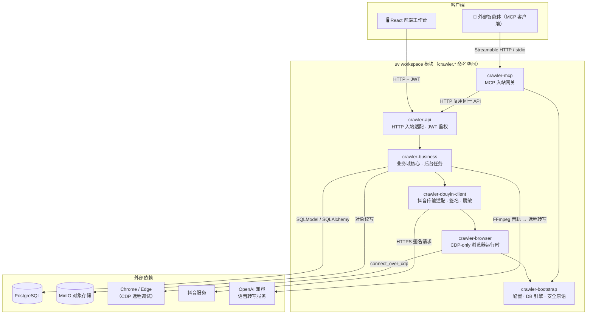
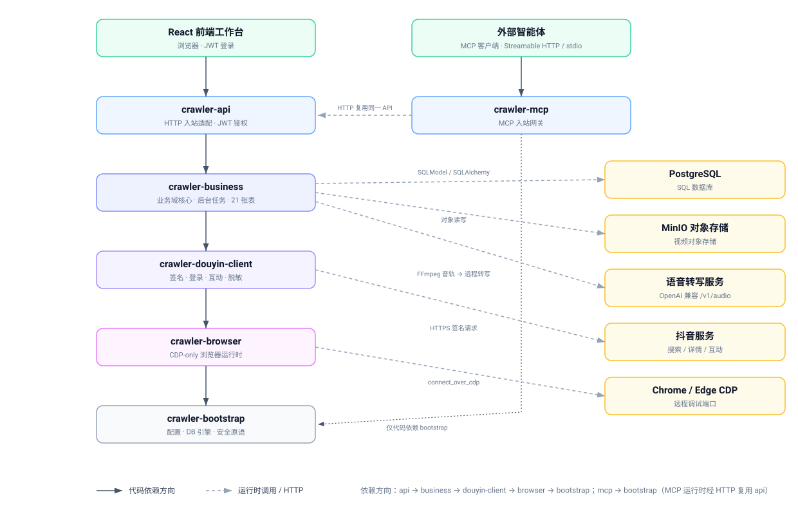

# 抖音采集工作台（Douyin Crawler Full Stack）

一个基于 FastAPI 官方 `full-stack-fastapi-template` 0.10.0 构建的**抖音数据采集与运营工作台**。
保留模板原有的 FastAPI、React、JWT、SQLModel/PostgreSQL、Alembic、Docker Compose 与 CI/CD 体系，
并把 [MediaCrawler](https://github.com/NanmiCoder/MediaCrawler) 的抖音请求逻辑重构为**纯 HTTP API 服务**，
面向搜索、作品详情、创作者主页、点赞 / 收藏等采集场景，提供任务管理、断点恢复、视频下载、字幕生成、
评论互动、赛道归类与 MCP 智能体接入等能力。

> ⚠️ **合规声明**：抖音适配代码沿用 MediaCrawler 的 **NON-COMMERCIAL LEARNING LICENSE 1.1**，
> 仅限非商业学习与研究；不得大规模抓取、干扰平台运营或用于违法用途。官方 Full Stack FastAPI Template
> 自身仍遵循根目录 MIT `LICENSE`。

---

## 目录

- [核心特性](#核心特性)
- [技术栈](#技术栈)
- [架构总览](#架构总览)
- [目录结构](#目录结构)
- [快速开始](#快速开始)
  - [方式一：Docker Compose（推荐）](#方式一docker-compose推荐)
  - [方式二：本地开发](#方式二本地开发)
- [配置说明](#配置说明)
- [使用指南](#使用指南)
  - [采集任务类型](#采集任务类型)
  - [REST API 概览](#rest-api-概览)
  - [赛道与数据归属](#赛道与数据归属)
  - [中断恢复](#中断恢复)
  - [视频下载与字幕](#视频下载与字幕)
  - [CDP 浏览器](#cdp-浏览器)
  - [MCP 智能体接入](#mcp-智能体接入)
- [测试](#测试)
- [开发约定](#开发约定)
- [文档](#文档)
- [许可证](#许可证)

---

## 核心特性

- **多类型采集任务**：支持关键词搜索（`search`）、指定作品详情（`detail`）、创作者主页（`creator`）、
  点赞（`liked`）、收藏（`collected`）五类任务，可附带评论 / 子评论抓取。
- **CDP-only 浏览器控制**：只通过 Chrome DevTools Protocol 连接已存在的浏览器（本机或 Docker 有头浏览器），
  禁止 `chromium.launch()` / `launch_persistent_context()` 及任何标准模式回退；连接失败直接让任务失败。
- **扫码 / Cookie 登录**：Cookie 仅存在运行任务的进程内存中，不落库、不进日志、不出现在响应中。
- **断点恢复**：任务持久化当前阶段与安全断点，服务退出、浏览器异常、网络失败或用户取消后均可按原任务 ID 续跑。
- **媒体流水线**：视频下载 + 远程 Whisper 字幕生成，支持本地 / MinIO 两种存储，可随时迁移，浏览器端流式预览支持拖进度。
- **赛道归类**：关键词、任务、资源库、评论、标签、互动统一按赛道（`track_id`）归属，支持跨任务批量检索与筛选。
- **MCP 接入**：以 Streamable HTTP / stdio 方式把全部能力暴露给外部智能体，零业务逻辑复制。
- **公平限流与账号槽位**：跨任务公平限流，大任务不阻塞小任务；支持多账号 / 多浏览器槽位池。
- **隐私脱敏**：创作者资料不落库，评论用户与账号互动均经 HMAC 脱敏 + 昵称打码后再入库。

---

## 技术栈

| 层 | 技术 |
|----|------|
| 后端 | Python 3.10+、FastAPI、SQLModel、PostgreSQL、Alembic、Pydantic v2 |
| 包管理 | [uv](https://docs.astral.sh/uv/) workspace 多项目（monorepo），统一 `crawler.*` 命名空间（PEP 420） |
| 前端 | React 19、TypeScript、Vite、Tailwind CSS v4、shadcn/ui、TanStack Router/Query、自动生成 OpenAPI 客户端 |
| 浏览器 | Playwright（仅 `connect_over_cdp`）、Chrome/Edge CDP |
| 签名 | PyExecJS + Node.js 执行 MediaCrawler 的 `a_bogus` JavaScript 签名 |
| 存储 | 本地文件系统 + MinIO 对象存储 |
| 字幕 | FFmpeg 音轨提取 + OpenAI 兼容远程 `/v1/audio/transcriptions` 服务 |
| 测试 | Pytest、Mypy（strict）、Ruff、Playwright E2E、架构契约测试 |
| 部署 | Docker Compose（基础设施与应用镜像分离）、GitHub Actions CI/CD |

---

## 架构总览

后端采用 uv workspace 多项目架构，`modules/` 下六个独立 Python 项目共享 `crawler.*` 命名空间，
依赖方向由打包元数据与 `tests/architecture/` 契约测试**双重强制**：



> 图例：实线箭头为**代码依赖方向**（`api → business → douyin-client → browser → bootstrap`、
> `mcp → bootstrap`，由打包元数据与契约测试强制）；虚线箭头为**运行时外部调用**。
> MCP 不直接依赖 `api` 代码，而是在运行时经 HTTP 复用同一 FastAPI 服务。
>
> 若查看环境不支持渲染 Mermaid，可打开静态架构图 [docs/architecture.svg](docs/architecture.svg)，
> 或直接内嵌预览：<br>
> 

| 模块 | 分发包 | 职责 |
|------|--------|------|
| [modules/bootstrap](modules/bootstrap/README.md) | `crawler-bootstrap` | 运行配置、数据库引擎、安全与日志原语（最底层，不依赖任何兄弟模块） |
| [modules/browser](modules/browser/README.md) | `crawler-browser` | CDP-only 浏览器运行时：端点发现、会话、远程槽位、stealth 注入 |
| [modules/douyin-client](modules/douyin-client/README.md) | `crawler-douyin-client` | 抖音传输适配：HTTP 客户端、a_bogus 签名、登录、互动写回、隐私脱敏 |
| [modules/business](modules/business/README.md) | `crawler-business` | 业务域核心：模型、用例编排、后台 Manager、存储/媒体/HTTP 驱动、Alembic 迁移 |
| [modules/api](modules/api/README.md) | `crawler-api` | HTTP 入站适配：参数校验、JWT 鉴权、异常/响应映射（运行时组合根） |
| [modules/mcp](modules/mcp/README.md) | `crawler-mcp` | MCP 入站网关：全部工具经 HTTP 代理复用同一 FastAPI 服务 |

架构门禁详见 [后端分层架构设计](docs/backend-layered-architecture.md) 与 [AGENTS.md](AGENTS.md)。

---

## 目录结构

```
.
├── modules/                    # uv workspace：六个独立 Python 项目
│   ├── bootstrap/  browser/  douyin-client/  business/  api/  mcp/
├── frontend/                   # React + TypeScript 前端（Vite + Tailwind + shadcn/ui）
├── docker/                     # 应用与浏览器镜像构建（api/ browser/ db/）
├── compose.yml                 # 应用服务编排（backend / frontend / mcp / 浏览器槽位池 / 测试）
├── compose.infra.yml           # 基础设施编排（db / minio / mailcatcher / 测试库准备）
├── scripts/                    # 本地启动、WSL 基础服务常驻/自启、测试、测试库准备、代理等脚本
├── tests/                      # Pytest 测试（architecture / business / api / utils）
├── docs/                       # 架构与产品文档
├── data/                       # 本地媒体输出、日志与运行时数据
├── .env / .env.local           # 环境变量（.env.local 覆盖 .env，不提交 Git）
├── pyproject.toml              # uv workspace 根配置（依赖组 / mypy / ruff / coverage）
└── AGENTS.md                   # 项目开发约定与质量门禁
```

---

## 快速开始

### 方式一：Docker Compose（推荐）

无需本地安装 Python / Node / PostgreSQL，一条命令拉起完整环境（后端、前端、MCP、PostgreSQL、MinIO、
有头浏览器、账号槽位池）。

**1. 配置密钥**

复制并修改 `.env`（首次运行至少修改以下三项）：

```dotenv
SECRET_KEY=用下面命令生成的长随机串
POSTGRES_PASSWORD=数据库密码
FIRST_SUPERUSER_PASSWORD=管理员密码
```

生成随机密钥：

```bash
python -c "import secrets; print(secrets.token_urlsafe(32))"
```

若使用 MinIO 存储，还需在 `.env.local` 设置强随机凭据（默认存储后端即 MinIO）：

```dotenv
MINIO_ACCESS_KEY=replace-me
MINIO_SECRET_KEY=replace-with-a-long-random-secret
```

**2. 启动完整栈（含浏览器 + 账号槽位池 + MinIO）**

```powershell
docker compose -f compose.infra.yml -f compose.yml --profile crawler up -d
```

**3. 访问**

| 服务 | 地址 |
|------|------|
| 前端工作台 | <http://127.0.0.1:5173> |
| 后端 API | <http://127.0.0.1:8000> |
| 交互式 API 文档（Swagger） | <http://127.0.0.1:8000/docs> |
| MCP 健康检查 | <http://127.0.0.1:8766/health> |
| MinIO 控制台 | <http://127.0.0.1:9101>（默认 `MINIO_ACCESS_KEY` / `MINIO_SECRET_KEY`） |
| 浏览器 noVNC 页面 | <http://127.0.0.1:6081/vnc.html?autoconnect=1&resize=scale> |

> 只启动基础设施（数据库 + MinIO，不含浏览器）时省略 `--profile crawler`；
> 需要 mailcatcher 时追加 `--profile dev`。

### 方式二：本地开发

适用于 Windows 本地直接运行后端 / 前端 / MCP。前置依赖：**Python 3.10+、`uv`、Node.js
（执行 `a_bogus` JavaScript 签名）、PostgreSQL**。

**1. 安装依赖并初始化数据库**

```powershell
uv sync
.\scripts\start-infra.ps1          # 拉起 WSL 里的 db / minio 并等库可连接
$env:POSTGRES_PORT = (Select-String -Path .env -Pattern '^POSTGRES_HOST_PORT=').Line.Split('=')[1]
Set-Location modules/business
uv run alembic upgrade head
Set-Location ../..
```

> Windows + WSL 的 Docker 环境请用 `scripts\start-infra.ps1` 而不是直接 `docker compose up`：
> WSL 在没有活动会话时会回收发行版，连同 `docker.socket` / `docker.service` 与容器一起停掉，
> Windows 侧后端就会报 `psycopg.errors.ConnectionTimeout: connection timeout expired`。
> 该脚本会启动一个常驻会话（`scripts/infra-keepalive.sh`）钉住发行版并等待数据库真正可连接；
> `.\scripts\install-infra-autostart.ps1` 可把它注册成登录自启动任务（`-Remove` 卸载）。
> 脚本只涉及 `compose.infra.yml` 的 db / minio，不会启动 backend / frontend / mcp / 浏览器容器。

**2. 一键启动后端 / 前端 / MCP**

```powershell
.\scripts\start-local.ps1 -Services all -Restart
```

也可以只启动单个服务：`-Services backend`、`frontend` 或 `mcp`。
每次启动的标准输出 / 错误输出写入 `data/logs/runs/<时间戳>` 目录。
启动 `backend` 时会先执行 `scripts\start-infra.ps1` 做基础服务自检（连外部数据库时可用 `-SkipInfra` 跳过）。

**3. 手动启动单个服务**

```powershell
# 后端
uv run fastapi run modules/api/src/crawler/api/main.py
# 或
uv run python -m uvicorn crawler.api.main:app --host 0.0.0.0 --port 8000

# MCP（streamable-http）
uv run python -m crawler.mcp --transport streamable-http
```

> 本地模式后端默认自动查找本机 Chrome/Edge，使用 `browser_data/douyin` 独立用户目录启动远程调试；
> 也可改为连接 Docker 远程浏览器（见 [CDP 浏览器](#cdp-浏览器)）。

---

## 配置说明

配置有两个来源：**环境变量/`.env`**（密钥、连接串、环境标识）与仓库根目录的
**[config.yaml](config.yaml)**（**所有非密钥配置项**：应用与认证、数据库与对象存储连接、
邮件、MCP、浏览器与槽位、账号登录会话、采集超时、风控档位与上限、互动风控、
媒体下载与存储、字幕转写、前端文案）。
优先级从高到低：

```
显式入参 > 环境变量 > .env.local > .env > config.yaml > 代码默认值
```

也就是说 **`.env` 里的同名项会盖住 `config.yaml`**：想让 YAML 生效，先把同名项从
`.env` / `.env.local` 删掉（容器编排、CI 需要临时覆盖时继续用环境变量即可）。
`config.yaml` 里每一项都用注释标注了对应的旧环境变量名，方便从 `.env` 迁移与排查；
测试会逐项验证"YAML 能设进去 + 环境变量能覆盖"，并保证每个配置项都被显式归类。
`config.yaml` 在进程启动时读取一次，改完要重启后端；容器部署已由 `compose.yml`
以只读方式挂载到 `/app/config.yaml`，文件缺失时自动回落到代码默认值。

两处 Spring Boot 风格的写法：

- **占位符**：`${ENV_VAR:默认值}` 可从环境变量取值，`${VAR}`（无默认）在变量缺失时视为
  未设置并回落代码默认；连接串、密钥这类按环境变化的值推荐用它，既能在一份文件里看全
  配置，又不把密钥写进仓库（如 `server: "${POSTGRES_SERVER:localhost}"`）。
- **profile 覆盖**：另建 `config.<profile>.yaml`（profile 取 `CRAWLER_CONFIG_PROFILE`
  或 `ENVIRONMENT`，默认 `local`），同名叶子键**深层覆盖**基础文件，等价于
  `application-<profile>.yml`。

当前 97 个配置项里 **88 项可由 `config.yaml` 提供**，仅 9 项只走环境变量：
8 个密钥（`SECRET_KEY`、`POSTGRES_PASSWORD`、`MINIO_ACCESS_KEY/SECRET_KEY`、
`WHISPER_API_KEY`、`MCP_API_PASSWORD`、`SMTP_PASSWORD`、`FIRST_SUPERUSER_PASSWORD`）
与测试进程开关 `TESTING`；这条边界由架构测试兜底。

除上文的密钥外，常用配置分组如下：

| 分组 | 关键变量 | 说明 |
|------|----------|------|
| 应用 | `DOMAIN` `FRONTEND_HOST` `ENVIRONMENT` `PROJECT_NAME` `BACKEND_CORS_ORIGINS` | 域名、环境、CORS |
| 认证 | `SECRET_KEY` `FIRST_SUPERUSER` `FIRST_SUPERUSER_PASSWORD` | JWT 密钥与首个管理员 |
| 数据库 | `POSTGRES_*` `TEST_POSTGRES_DB` | 连接信息与测试库（测试库名必须 `_test` 结尾） |
| 浏览器 | `DOUYIN_REMOTE_CDP_SLOTS` | 兼容项：旧的远程槽位 JSON；浏览器与槽位配置见 `config.yaml` 的 `browser` 段 |
| 采集/风控/互动 | — | 已迁到 `config.yaml` 的 `crawl` / `risk_control` / `interaction` 段 |
| 媒体 | — | 已迁到 `config.yaml` 的 `media` 段（`MINIO_*` 连接信息仍留在这里） |
| MinIO | `MINIO_ENDPOINT` `MINIO_ACCESS_KEY` `MINIO_SECRET_KEY` `MINIO_BUCKET` `MINIO_SECURE` | 对象存储连接 |
| 字幕 | `WHISPER_API_KEY` | 只有 API Key 走环境变量，其余见 `config.yaml` 的 `subtitle` 段 |
| MCP | `MCP_API_BASE_URL` `MCP_API_USERNAME` `MCP_API_PASSWORD` | MCP 网关登录后端方式 |
| 镜像 | `DOCKER_IMAGE_BACKEND` `DOCKER_IMAGE_FRONTEND` | Compose 构建镜像名 |

> 私密值（API Key、密码等）建议放在不提交 Git 的 `.env.local` 中。

`config.yaml` 还承担三处「原先写死在代码里」的配置：

1. **任务规模上限**：`risk_control.limits.max_awemes_per_task` /
   `max_comments_per_aweme` 是唯一上限（模型不再硬编码 `maximum`），超限请求直接 422；
2. **重试退避与轮询**：`media.retry_backoff`（base/multiplier/max）与
   `crawl.account_wait_poll_seconds`；
3. **前端展示文案**：`ui.labels` 通过 `GET /douyin/ui-labels` 下发（前端先用内置默认渲染、
   取到结果后覆盖，接口失败不影响页面）。

---

## 使用指南

### 采集任务类型

| 类型 | `crawl_type` | 说明 |
|------|--------------|------|
| 关键词搜索 | `search` | 按关键词搜索作品，可带评论 / 子评论 |
| 作品详情 | `detail` | 指定作品 / 评论 / 合集等目标 |
| 创作者主页 | `creator` | 抓取某创作者全部作品 |
| 点赞 | `liked` | 抓取已点赞的作品关系 |
| 收藏 | `collected` | 抓取已收藏的作品关系 |

创建搜索任务示例：

```json
{
  "crawl_type": "search",
  "login_type": "qrcode",
  "keywords": ["FastAPI"],
  "max_awemes": 10,
  "fetch_comments": true,
  "fetch_sub_comments": false,
  "max_comments_per_aweme": 10,
  "concurrency": 1,
  "request_delay_level": "steady"
}
```

`request_delay_level` 支持 `fast`（随机 1–2 秒）、`steady`（随机 3–6 秒）、`ultra_steady`（随机 6–12 秒），
每次请求在范围内重新随机等待；旧客户端仍可传 `request_interval_seconds` 作为最小等待下限。

### REST API 概览

所有接口在 `/api/v1/douyin` 下，使用模板原有 JWT 鉴权：

| 方法 | 路径 | 说明 |
|------|------|------|
| `POST` | `/tasks` | 创建 search/detail/creator/liked/collected 任务 |
| `GET` | `/tasks`、`/tasks/{id}` | 查看任务历史与进度 |
| `POST` | `/tasks/{id}/cancel` | 取消任务 |
| `POST` | `/tasks/{id}/resume` | 从断点继续爬取、下载与字幕 |
| `GET` | `/tasks/{id}/qrcode` | 获取扫码登录二维码 |
| `GET` | `/tasks/{id}/awemes` | 分页读取作品 |
| `GET` | `/tasks/{id}/comments` | 分页读取评论 |
| `POST` | `/tasks/{id}/awemes/{aweme_id}/comments/recrawl` | 单视频评论重爬 |
| `POST` | `/tasks/{id}/awemes/{aweme_id}/creator/crawl` | 从视频发现作者并抓取作者作品 |
| `GET` | `/tasks/{id}/actions` | 分页读取点赞 / 收藏关系 |
| `GET` | `/tasks/{id}/media` | 下载 / 字幕进度、错误与字幕正文 |
| `GET` | `/tasks/{id}/media-summary` | 媒体状态汇总 |
| `POST` | `/tasks/{id}/media/process` | 补做视频下载与字幕 |
| `POST` | `/tasks/{id}/media/retry` | 重试失败媒体任务 |
| `POST` | `/tasks/{id}/media/migrate-to-minio` | 校验后迁移本地视频到 MinIO |
| `POST` | `/tasks/{id}/media/{asset_id}/retranslate` | 强制重新生成字幕 |
| `GET` | `/tasks/{id}/media/{asset_id}/file` | 鉴权下载已保存视频 |
| `POST` | `/tasks/{id}/media/{asset_id}/preview-session` | 创建短时预览会话 |
| `GET` | `/tasks/{id}/media/{asset_id}/preview` | 流式播放（支持 Range） |

### 赛道与数据归属

赛道（`track_id`）是关键词、采集任务和后续内容筛选的一级业务维度。每个关键词 / 任务必须归属一个赛道；
未传 `track_id` 时自动归属当前用户唯一的“默认赛道”（默认赛道不可重命名或删除）。任务、关键词、资源库、
评论、标签、互动列表均支持按 `track_id` 筛选；派生任务（评论重爬、作者作品跟进）继承源任务赛道。

### 中断恢复

任务会持久化当前阶段与安全断点。API 服务退出、浏览器异常、网络失败或用户取消后，可用原任务 ID 继续：

```json
{
  "resume_crawl": true,
  "resume_media": true,
  "cookies": "可选，仅本次恢复使用"
}
```

- 关键词任务保存关键词序号、页码和中断页待补评论；指定作品保存已完成目标索引。
- 创作者 / 点赞 / 收藏任务保存分页游标及中断页。
- 视频与字幕恢复会扫描全部作品，本地文件或 MinIO 对象已完成时跳过。
- 两个布尔字段都省略时，服务按任务阶段自动选择恢复范围。
- Cookie、Token 与浏览器登录信息不进入断点；Cookie 登录可恢复时重新提交，留空复用 CDP 浏览器登录态。

### 视频下载与字幕

任务媒体配置：

```json
{
  "download_media": true,
  "translate_subtitles": true,
  "media_processing_mode": "immediate",
  "media_storage": "minio",
  "transcription_language": "auto"
}
```

- `immediate`：作品入库后立即后台下载 / 生成字幕；`batch`：全部抓完后批量处理。
- `media_storage`：`local` 或 `minio`；省略时用服务端 `MEDIA_STORAGE_BACKEND` 默认值。
- `translate_subtitles=true` 自动启用视频下载。
- MinIO 模式只保留上传暂存，上传成功即删；数据库只存 bucket 与对象键，不存访问密钥。
- 字幕严格调用 OpenAI 兼容远程 `/v1/audio/transcriptions`，后端先以 FFmpeg 提取 16kHz 单声道音轨再上传，
  不包含本地模型、无本地回退。配置见 `.env` 的 `WHISPER_API_*` / `FFMPEG_BINARY`。

### CDP 浏览器

浏览器只允许 CDP 控制。服务级默认模式由 `DOUYIN_BROWSER_MODE` 决定，创建任务时可用 `browser_mode`（`local`/`remote`）单独覆盖。

**本机浏览器（local）**

默认自动查找本机 Chrome/Edge，用 `browser_data/douyin` 独立用户目录启动远程调试；也可先手动启动：

```powershell
chrome.exe --remote-debugging-port=9222 --user-data-dir=D:\browser-data\douyin
```

```dotenv
DOUYIN_BROWSER_MODE=local
DOUYIN_CDP_CONNECT_EXISTING=true
DOUYIN_CDP_HOST=127.0.0.1
DOUYIN_CDP_PORT=9222
```

本机同样支持多浏览器槽位并行：默认提供 4 个本机槽位 `local-1 … local-4`，每个槽位独立 Profile
（`browser_data/douyin-local/<槽位名>`）与调试端口（自 `DOUYIN_LOCAL_CDP_PORT_BASE` 起递增），
在「浏览器监控中心」与账号创建弹窗中可与账号一一绑定。槽位浏览器由服务按需拉起，会话结束后
保持常驻以便复用登录态。

```dotenv
DOUYIN_LOCAL_CDP_SLOT_COUNT=4
DOUYIN_LOCAL_CDP_PORT_BASE=9333
DOUYIN_LOCAL_CDP_USER_DATA_DIR=browser_data/douyin-local
```

**Docker 远程浏览器（remote）**

项目提供独立有头 Chrome 服务（Xvfb + noVNC + 持久化登录目录），默认使用 Docker 浏览器、账号槽位池与 MinIO：

```powershell
docker compose -f compose.infra.yml -f compose.yml --profile crawler up -d douyin-browser
```

本机后端经 `127.0.0.1:9223` 连接它；Compose 内后端经 `douyin-browser:9222` 连接。全局默认远程时设置：

```dotenv
DOUYIN_BROWSER_MODE=remote
DOUYIN_REMOTE_CDP_HOST=127.0.0.1
DOUYIN_REMOTE_CDP_PORT=9223
```

首次扫码后的登录态保存在 `douyin-browser-profile` 卷中，重建容器不丢失。远程主机 / 端口只能由服务端配置，
不能通过请求传入。CDP 端口等同浏览器完全控制权限，仅绑定宿主机回环地址，请勿暴露公网。

### MCP 智能体接入

MCP 是现有 FastAPI 的网关，所有工具经模板登录接口鉴权并复用同一套任务、权限与数据库。将下面配置原样复制到支持
MCP 的智能体工具中：

```json
{
  "mcpServers": {
    "douyin-crawler": {
      "type": "streamable-http",
      "url": "http://127.0.0.1:8766/mcp"
    }
  }
}
```

客户端若不识别 `streamable-http`，只把 `type` 改成 `http`，地址不变。该 JSON **不需要 API Key、账号或密码**，
凭据只存在于服务端（`MCP_API_USERNAME`/`MCP_API_PASSWORD`，缺省回退 `FIRST_SUPERUSER`）。端口仅监听
`127.0.0.1`，连接前可访问 `http://127.0.0.1:8766/health` 验证（返回 `{"status":"ok"}`）。

不使用 Docker 时可用 stdio 模式：`uv run python -m crawler.mcp`。
MCP 暴露 32 个工具：创建/查询/取消/恢复任务、单视频评论重爬、作者作品抓取、完成后媒体处理、媒体进度、
失败重试、重新翻译、作品/评论/互动分页读取、标签查询与历史标签同步、MinIO 迁移等。详见 [媒体处理与 MCP 设计](docs/媒体处理与MCP设计.md)。

---

## 测试

测试禁止连接用户正在使用的 `POSTGRES_DB`，使用独立的 `TEST_POSTGRES_DB`（默认 `app_test`，名称必须以 `_test`
结尾），且测试后端会关闭任务恢复、媒体队列和互动后台执行器。

**本地后端测试**（Windows PowerShell）：

```powershell
.\scripts\prepare-test-database.ps1   # 用一致性快照覆盖测试库（不改用户库）
.\scripts\test.ps1                    # 运行 pytest
```

前端 Playwright 默认启动独立的 `5174` 前端与 `8001` 测试后端，自动刷新测试库，不复用 `5173/8000` 用户服务。
容器测试：

```powershell
docker compose -f compose.infra.yml -f compose.yml --profile test run --rm playwright bunx playwright test
```

---

## 开发约定

质量门禁（后端变更在仓库根目录至少执行）：

```bash
uv run ruff check modules tests
uv run ruff format modules tests --check
uv run mypy -p crawler.bootstrap -p crawler.browser -p crawler.douyin_client -p crawler.business -p crawler.api -p crawler.mcp
uv run python -m compileall -q modules tests
uv run pytest
(cd modules/business && uv run alembic check)
```

关键约束：

- 依赖方向固定 `api → business → douyin-client → browser → bootstrap`、`mcp → bootstrap`，禁止反向依赖。
- Cookie、Token 与原始账号 ID 不得写入数据库、日志或 API 响应。
- 禁止 `chromium.launch()` / `launch_persistent_context()` 及 CDP 失败后的标准模式回退。
- 修改模型必须同步生成 Alembic 迁移（`modules/business/alembic/versions/`）。
- 抖音适配代码保留非商业许可证与版权来源（`modules/douyin-client/src/crawler/douyin_client/NON_COMMERCIAL_LICENSE`）。

完整约定见 [AGENTS.md](AGENTS.md)。

---

## 文档

| 文档 | 说明 |
|------|------|
| [backend-layered-architecture.md](docs/backend-layered-architecture.md) | 后端分层架构与依赖门禁 |
| [媒体处理与MCP设计.md](docs/媒体处理与MCP设计.md) | 媒体流水线与 MCP 设计 |
| [项目业务与技术架构分析.md](docs/项目业务与技术架构分析.md) | 业务与技术架构分析 |
| [灵感采集台产品需求文档PRD.md](docs/灵感采集台产品需求文档PRD.md) | 前端产品需求 |
| 各模块 [README](modules/) | bootstrap / browser / douyin-client / business / api / mcp 分模块说明 |
| [frontend/README.md](frontend/README.md) | 前端开发说明 |

---

## 许可证

- 本项目模板底座（Full Stack FastAPI Template）遵循 MIT 许可证，见根目录 [LICENSE](LICENSE)。
- 抖音适配代码（`modules/douyin-client`）沿用 MediaCrawler 的 **NON-COMMERCIAL LEARNING LICENSE 1.1**，
  仅限非商业学习与研究用途。
