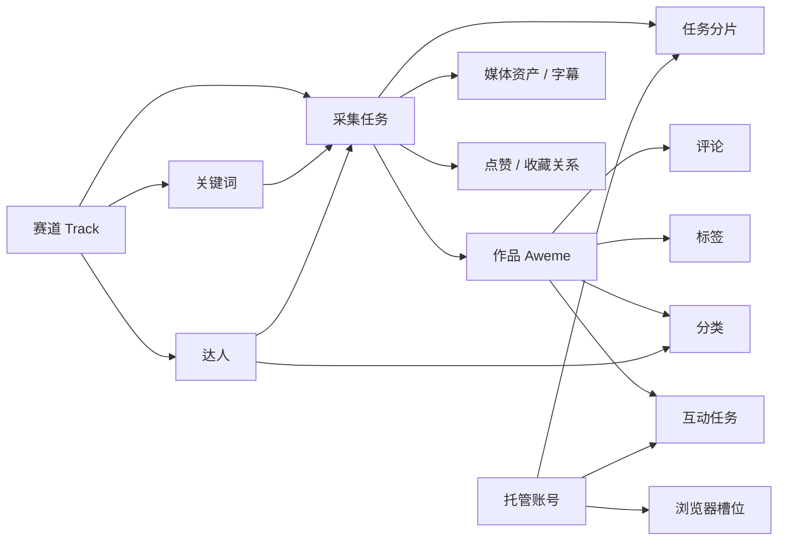

# 抖音采集工作台 · 产品规格说明书

| 项目 | 内容 |
| --- | --- |
| 文档名称 | 抖音采集工作台产品规格说明书（Product Specification） |
| 文档版本 | v2.0 |
| 文档状态 | 现状基线 · 与代码实现逐项对齐，可直接作为迭代与验收基准 |
| 编制日期 | 2026-09-25 |
| 代码基线 | 分支 `refactor/browser-capability-platform`，提交 `4146809` |
| 适用产品 | 抖音采集工作台（Douyin Crawler Full Stack）；前端品牌名「灵感采集台」 |
| 目标读者 | 产品、设计、前端/后端研发、测试、运维、数据合规 |
| 事实来源 | 仓库 `README.md`、`AGENTS.md`、`config.yaml`、`modules/*` 源码、运行期 OpenAPI（111 条路径）、SQLModel metadata（31 张表）、MCP 工具注册表（32 个工具） |

## 修订记录

| 版本 | 日期 | 说明 |
| --- | --- | --- |
| v1.0 | 2026-08-19 | 基于当时前端原型逆向归档的首版产品需求文档 |
| v2.0 | 2026-09-25 | 重写为规格说明书口径：按域拆分功能规格并补全编号，新增状态机、数据、接口、非功能、配置与验收章节，全部条目与当前实现核对 |

---

## 0. 阅读说明

- 本文是**规格说明书（SRS 口径）**，不是愿景型需求文档。文中每条要求描述的是当前实现对内对外承诺的行为，可直接转写成回归测试用例或变更评审清单。
- 编号约定：
  - `FR-{域}-{序号}`：功能需求；
  - `BR-{域}-{序号}`：业务规则；
  - `NFR-{序号}`：非功能需求；
  - `AC-{序号}`：验收标准。
- 优先级：**P0** 核心链路（缺失即业务不闭环）/ **P1** 重要能力 / **P2** 体验增强。
- 枚举值统一以「`英文值`（界面中文）」书写；英文值是前后端与 MCP 的契约值，中文是界面展示值（可由 `config.yaml` 的 `ui.labels` 覆盖）。
- 文档与实现不一致时，以当前代码为现状事实，并在修订记录登记差异，不允许两份口径长期并存。

---

## 1. 产品概述

### 1.1 背景与问题

抖音内容运营团队的日常工作存在四类断点：

1. **采集散**：按关键词、作品、创作者抓内容依赖临时脚本与手工操作，任务状态不可见，失败无感知，中断后无法续跑。
2. **资产乱**：抓回的视频、评论散落在本地目录，无法按市场方向归集、筛选与复用。
3. **互动险**：评论、回复、私信直接在账号上手工执行，缺少确认环节、配额控制与操作留痕，风控风险高。
4. **环境杂**：多账号共用浏览器指纹与登录态，容易串号；远程浏览器状态不可见，登录失效无从排查。

### 1.2 产品定位

**抖音采集工作台**是一套自托管的、以任务为单位的抖音内容采集与运营系统：以「赛道」组织市场方向，以「关键词 / 达人 / 任务」驱动内容采集，沉淀视频、评论、达人、标签、分类五类内容资产，并通过托管账号池完成**人工确认式**互动，全程附带浏览器实时监控与风控配额管理。

产品同时对外提供两类入口：

- **人机界面**：React 前端工作台（浏览器访问）；
- **智能体入口**：MCP 网关，把同一套能力以 32 个工具暴露给外部智能体，不复制任何业务逻辑。

### 1.3 目标用户与角色

| 角色 | 典型诉求 | 主要使用页面 |
| --- | --- | --- |
| 内容运营 | 按赛道铺关键词、跑任务、看结果、挑素材 | 工作台、抖音任务、视频资源库、评论管理 |
| 选题/编导 | 找对标内容与达人，按标签与分类翻看素材 | 视频资源库、达人列表、标签管理、内容分类 |
| 账号运营 | 维护托管账号、绑定浏览器、执行互动 | 账号池、浏览器管理、互动任务 |
| 系统管理员 | 管用户、看接口与 MCP 能力、排障 | 用户管理、开发者中心、请求日志 |
| 外部智能体 | 以自然语言驱动采集与素材检索 | MCP（无 UI） |

### 1.4 产品目标与衡量口径

| 目标 | 衡量口径（由现有能力支撑） |
| --- | --- |
| 采集可追踪 | 任务 9 态状态机 + 3 阶段进度 + 秒级轮询 + 断点续跑 |
| 资产可沉淀 | 视频资源库 / 评论 / 达人 / 标签 / 分类五类视图，按赛道与来源归集 |
| 互动可管控 | 预检 → 人工确认 → 排队执行三段式 + 每日配额 + 24 小时防重 + 截图留痕 |
| 环境可隔离 | 每账号独立浏览器空间 + 槽位一对一绑定 + 账号池调度策略 |
| 能力可复用 | 111 条 HTTP 接口 + 32 个 MCP 工具，单一业务实现 |

### 1.5 范围

**本规格覆盖**：认证与会话、工作台概览、赛道、关键词、达人、采集任务、任务结果、媒体与字幕、视频资源库、评论、标签、内容分类、我的（点赞/收藏/关注）、互动、账号池与浏览器槽位、请求日志、MCP 网关、系统管理。

**明确不在范围内**（见 `NFR-12` 与第 11 章）：

- 本地 Whisper 模型与任何字幕转写的本地回退；
- 浏览器非 CDP 启动方式（`chromium.launch()` / `launch_persistent_context()`）；
- 平台违规用途（大规模抓取、干扰平台运营、商业牟利）；
- 面向公网的多租户 SaaS 化部署与计费能力。

---

## 2. 术语与概念模型

### 2.1 术语表

| 术语 | 定义 |
| --- | --- |
| 赛道（Track） | 市场方向的一级组织单元。关键词、达人、任务、内容资产沿赛道归集；每个用户有一个不可删除的**默认赛道** |
| 关键词（Keyword） | 采集搜索词，归属唯一赛道；状态由关联任务聚合推导 |
| 达人（Creator） | 用户维护的达人名单条目，以 `(owner_id, sec_uid)` 唯一；可绑定赛道，可回填主页资料 |
| 任务（CrawlTask） | 一次采集作业，8 种类型、9 态状态机 |
| 分片（Shard） | 多账号并行时按账号拆分的子任务，每分片独立浏览器空间 |
| 作品（Aweme） | 抖音视频实体，采集结果的主载体 |
| 互动关系（UserAction） | 点赞 / 收藏类关系记录，关联账号与作品 |
| 媒体资产（MediaAsset） | 某个作品在某个任务下的视频文件记录（本地或 MinIO） |
| 字幕（Subtitle） | 由远程 OpenAI 兼容转写服务生成的文本与分段时间戳 |
| 迁移（Migration） | 本地视频上传到 MinIO 的 7 态单向流程（上传 → 校验 → 切换 → 清理） |
| 互动任务（Interaction） | 视频评论 / 评论回复 / 作者私信，人工确认后由托管浏览器执行 |
| 账号池（Account Pool） | 托管账号集合，支持最少负载 / 轮询 / 加权轮询三种调度策略 |
| 槽位（Browser Slot） | 一个常驻浏览器 + 持久化登录空间，与账号一对一绑定 |
| 来源（Source） | 作品/任务的来源分类：`keyword` / `creator` / `mixed` / `task` |
| 分类（Category） | 用户自定义的内容归档维度，可挂视频与达人，与标签互补 |

### 2.2 核心实体关系



---

## 3. 信息架构与权限

### 3.1 导航结构

前端分为 5 个模块，共 16 个功能页面（另有登录、注册、找回密码、重置密码与应用内设置页）：

| 模块 | 页面 | 路由 | 可见性 |
| --- | --- | --- | --- |
| 概览 | 工作台 | `/` | 登录用户 |
| 采集 | 赛道管理 | `/douyin-tracks` | 登录用户 |
| 采集 | 抖音任务 | `/douyin` | 登录用户 |
| 采集 | 关键词管理 | `/douyin-keywords` | 登录用户 |
| 内容 | 视频资源库 | `/douyin-library` | 登录用户 |
| 内容 | 我的 | `/douyin-mine` | 登录用户 |
| 内容 | 评论管理 | `/douyin-comments` | 登录用户 |
| 内容 | 达人列表 | `/douyin-creators` | 登录用户 |
| 内容 | 内容分类 | `/douyin-categories` | 登录用户 |
| 内容 | 标签管理 | `/douyin-tags` | 登录用户 |
| 运营与风控 | 互动任务 | `/douyin-interactions` | 登录用户 |
| 运营与风控 | 账号池 | `/douyin-accounts` | 登录用户 |
| 运营与风控 | 浏览器管理 | `/douyin-browsers` | 登录用户 |
| 运营与风控 | 请求日志 | `/douyin-request-logs` | 登录用户 |
| 系统 | 开发者中心 | `/developer-tools` | 超级管理员 |
| 系统 | 用户管理 | `/admin` | 超级管理员 |

任务详情（`/douyin/{taskId}`）、沉浸播放（`.../feed`）、赛道详情（`/douyin-tracks/{trackId}`）、达人详情（`/douyin-creators/{creatorId}`）、视频详情（`/douyin-library/video/{awemeId}`）为二级页面。

### 3.2 角色与权限矩阵

| 能力 | 普通用户 | 超级管理员 |
| --- | --- | --- |
| 采集任务、赛道、关键词、达人、媒体、互动、账号池 | 仅本人数据 | 可跨用户读取（写操作仍受归属校验） |
| 用户管理（`/admin`） | ✗ | ✓ |
| 开发者中心（接口与 MCP 工具清单） | ✗ | ✓ |
| 系统集成信息（`GET /system/integrations/`） | ✗ | ✓（需鉴权） |
| 本地私有路由（`/private/*`） | 仅 `ENVIRONMENT=local` 时挂载 | 同左，且要求超级管理员 |

`BR-SYS-01`：所有抖音域数据以 `owner_id` 归属，非超管用户的越权访问一律返回 404（不泄露资源存在性）。

---

## 4. 功能规格

### 4.1 认证与会话（FR-AUTH）

| 编号 | 需求 | 优先级 |
| --- | --- | --- |
| FR-AUTH-01 | 邮箱 + 密码登录，签发 JWT 访问令牌，默认有效期 11520 分钟（8 天），可由配置调整 | P0 |
| FR-AUTH-02 | 支持注册（`/users/signup`）、找回密码（邮件令牌，默认 48 小时有效）、重置密码 | P1 |
| FR-AUTH-03 | 支持修改本人密码、更新本人资料、删除本人账号 | P1 |
| FR-AUTH-04 | 支持超级管理员创建/修改/删除用户 | P1 |
| FR-AUTH-05 | 所有 `/api/v1/douyin/*` 接口需携带 JWT；缺失或过期返回 401 | P0 |
| FR-AUTH-06 | 健康检查 `GET /utils/health-check/` 无需鉴权，返回可用状态 | P0 |

**异常与边界**

- `BR-AUTH-01`：注册密码强度、邮箱唯一性由后端校验，冲突返回 400 系列错误并给出可读原因。
- `BR-AUTH-02`：邮件功能在 `EMAILS`/SMTP 未配置时不可用，此时找回密码链路不可用，但登录不受影响。

### 4.2 工作台概览（FR-HOME）

| 编号 | 需求 | 优先级 |
| --- | --- | --- |
| FR-HOME-01 | 指标卡：任务总数、作品总数、评论总数、可用账号数 | P0 |
| FR-HOME-02 | 账号概况：可用账号数与账号池总数；账号接口异常时给出错误态与重试 | P1 |
| FR-HOME-03 | 任务概况：进行中任务数，以及「等待扫码 / 失败 / 中断」的待处理项数量，并置顶告警卡 | P0 |
| FR-HOME-04 | 最近任务列表：按状态与作品/评论进度展示最近 6 条，可跳转任务详情 | P1 |
| FR-HOME-05 | 提供新手引导清单（Onboarding Checklist），引导完成「赛道 → 账号 → 任务 → 素材」最小闭环 | P2 |
| FR-HOME-06 | 刷新策略：存在运行中任务时每 5 秒自动刷新，全部空闲即停止轮询；异常态提供人工重试 | P1 |

`BR-HOME-01`：指标口径须在界面上显式标注。当任务总数超过一页（100 条）时，作品与评论数标注为「近 100 个任务」；否则标注为「全部任务」。

### 4.3 赛道管理（FR-TRACK）

| 编号 | 需求 | 优先级 |
| --- | --- | --- |
| FR-TRACK-01 | 创建赛道：名称（同名去重，按规范化名称判重）+ 描述 + 启用状态 | P0 |
| FR-TRACK-02 | 赛道列表：默认赛道置顶，其余按更新时间倒序；支持搜索与状态筛选 | P0 |
| FR-TRACK-03 | 赛道详情：聚合关键词、达人、任务与内容统计 | P0 |
| FR-TRACK-04 | 编辑赛道名称、描述、启用状态 | P0 |
| FR-TRACK-05 | 停用赛道：先停止该赛道下未结束的任务，再置为停用 | P1 |
| FR-TRACK-06 | 删除赛道：执行 `reset`（清理该赛道业务数据）后再删除记录 | P1 |
| FR-TRACK-07 | 批量删除赛道 | P1 |
| FR-TRACK-08 | 赛道内关键词与达人的绑定、解绑、批量建任务 | P1 |

**业务规则**

- `BR-TRACK-01`：每个用户自动拥有唯一**默认赛道**（`is_default`），承接未指定归属的数据；默认赛道不可重命名、不可停用、不可删除。
- `BR-TRACK-02`：同一用户内赛道名称唯一（比较用规范化名称）。
- `BR-TRACK-03`：创建任务或关键词时未传 `track_id`，自动归属默认赛道。
- `BR-TRACK-04`：派生任务（单视频评论重爬、从作品反查作者）继承源任务的赛道。
- `BR-TRACK-05`：赛道删除是**破坏性操作**，须二次确认；返回被清理的赛道、关键词、达人、任务、作品、评论数量。

### 4.4 关键词管理（FR-KW）

| 编号 | 需求 | 优先级 |
| --- | --- | --- |
| FR-KW-01 | 新增关键词（归属赛道 + 启用状态） | P0 |
| FR-KW-02 | 关键词列表：分页、搜索、按赛道/来源/状态筛选、排序 | P0 |
| FR-KW-03 | 关键词状态展示：`unprocessed`（未处理）/ `active`（进行中）/ `crawled`（已采集）/ `failed`（失败） | P1 |
| FR-KW-04 | 关键词批量新增、批量删除 | P1 |
| FR-KW-05 | 关键词批量建任务：按 `separate`（一词一任务）拆分，服务端固定一词一任务 | P0 |
| FR-KW-06 | 查看某关键词的关联任务列表 | P1 |
| FR-KW-07 | 标签式关键词同步：单任务同步、历史任务批量回填同步 | P1 |

**业务规则**

- `BR-KW-01`：关键词以 `(owner_id, normalized_keyword)` 唯一，重复新增不产生第二条记录。
- `BR-KW-02`：关键词状态不落库，由关联任务状态实时聚合推导。
- `BR-KW-03`：关键词同步来源记录为 `automatic`（任务创建/执行自动同步）/ `manual`（界面手动触发）/ `history`（历史回填）/ `batch_task`（批量建任务绑定）。

### 4.5 达人管理（FR-CRE）

| 编号 | 需求 | 优先级 |
| --- | --- | --- |
| FR-CRE-01 | 新增达人（赛道 + 主页 `sec_uid` / 主页链接），支持批量导入 | P0 |
| FR-CRE-02 | 达人列表：分页、搜索、按赛道/状态筛选、排序、三视图（卡片/行/表格） | P0 |
| FR-CRE-03 | 达人状态：`unprocessed` / `active` / `crawled` / `failed`（由关联任务聚合） | P1 |
| FR-CRE-04 | 达人详情：主页基础信息（昵称、粉丝数、获赞总数、主页作品数、签名、头像、抖音号、IP 归属地） | P1 |
| FR-CRE-05 | 刷新达人主页信息（单个 / 批量任务后补齐），记录最近同步时间与失败原因 | P1 |
| FR-CRE-06 | 达人的启用 / 停用（停用达人不能用于批量建任务） | P1 |
| FR-CRE-07 | 达人批量建任务、批量删除 | P1 |
| FR-CRE-08 | 从采集作品同步达人（含 `is_placeholder` 占位达人转正） | P2 |

**业务规则**

- `BR-CRE-01`：达人以 `(owner_id, sec_uid)` 唯一；`sec_uid` 是用户主动录入的资产，明文存储。
- `BR-CRE-02`：`creator_hash` 由 `sec_uid` 派生，用于与采集作品（脱敏后）关联；两者不可混用。
- `BR-CRE-03`：由历史采集作品导入的达人先建为占位（`is_placeholder=true`），补齐主页信息后转正。
- `BR-CRE-04`：主页计数字段使用 64 位整型存储（头部账号「获赞总数」可达数百亿）。

### 4.6 采集任务创建（FR-TASK）

| 编号 | 需求 | 优先级 |
| --- | --- | --- |
| FR-TASK-01 | 支持 8 种采集类型（见 `BR-TASK-01`） | P0 |
| FR-TASK-02 | 任务参数全部为**任务级对象**，禁止修改模块级全局配置 | P0 |
| FR-TASK-03 | 任务创建接口同时服务前端与 MCP | P0 |
| FR-TASK-04 | 创建前校验参数组合合法性，非法组合在解析阶段直接失败 | P0 |
| FR-TASK-05 | 支持从赛道详情、关键词列表、达人列表直接批量建任务 | P1 |
| FR-TASK-06 | 创建成功后返回任务详情，可按任务 ID 获取扫码二维码 | P0 |

**任务类型（`crawl_type`）**

| 值 | 说明 | 必填目标 |
| --- | --- | --- |
| `search` | 关键词搜索作品 | `keywords`（≤20） |
| `detail` | 指定作品/评论/合集详情 | `video_ids`（≤1000） |
| `creator` | 抓取指定创作者主页作品 | `creator_ids`（≤100） |
| `creator_from_aweme` | 由作品反查其创作者主页再抓作品 | `video_ids` |
| `creator_profile` | 指定达人的主页详情（昵称/粉丝/主页作品数等） | `creator_ids` |
| `liked` | 当前登录账号的点赞列表 | 托管账号 |
| `collected` | 当前登录账号的收藏列表 | 托管账号 |
| `following` | 当前登录账号的关注博主列表 | **必须**指定托管账号 |

**任务参数规格**

| 参数 | 类型/范围 | 默认 | 说明 |
| --- | --- | --- | --- |
| `track_id` | UUID | 默认赛道 | 任务归属赛道 |
| `login_type` | `qrcode` / `cookie` | `qrcode` | 提交 `cookies` 时自动改为 `cookie` |
| `browser_mode` | `local` / `remote` | 服务端默认 | 覆盖浏览器模式 |
| `cookies` | SecretStr | 空 | 一次性 Cookie，不落库、不进日志 |
| `start_page` | ≥1 | 1 | 搜索起始页 |
| `max_awemes` | ≥1 | 10 | 单任务作品上限，硬上限由配置（默认 1000） |
| `fetch_comments` | bool | true | 是否抓一级评论 |
| `fetch_sub_comments` | bool | false | 是否抓二级评论，依赖 `fetch_comments` |
| `max_comments_per_aweme` | ≥1 | 10 | 单作品评论上限，硬上限由配置（默认 1000） |
| `concurrency` | 1~5 | 1 | 抓取并发 |
| `request_delay_level` | `fast` / `steady` / `ultra_steady` | `fast` | 请求间隔档位 |
| `request_interval_seconds` | 0.2~60 | 1.0 | 间隔下限，与档位合成随机区间 |
| `task_interval_seconds` | 0~3600 | 空 | 任务间冷却；为空沿用请求风控区间 |
| `publish_time` | 0 / 1 / 7 / 180 | 0 | 发布时间过滤：不限 / 一天 / 一周 / 半年 |
| `media_processing_mode` | `none` / `immediate` / `batch` | `none` | 媒体处理触发方式 |
| `media_storage` | `local` / `minio` | 服务端默认 | 媒体存储后端 |
| `download_media` | bool | false | 是否下载视频 |
| `translate_subtitles` | bool | false | 是否转写字幕（隐含开启下载） |
| `subtitle_only` | bool | false | 仅转字幕，不保留视频 |
| `sync_creator_profiles` | bool | false | 任务成功后补齐达人主页信息 |
| `transcription_language` | 2~32 字符 | `auto` | 转写语言 |
| `account_id` / `account_ids` / `account_pool_id` | UUID / ≤20 / UUID | 空 | 三选一，指定执行账号 |
| `account_strategy` | `least_loaded` / `round_robin` / `weighted_round_robin` | `least_loaded` | 账号池调度策略 |
| `comment_source_task_id` | UUID | 空 | 评论补采来源任务，仅 `detail` 且仅一个作品 |

**业务规则**

- `BR-TASK-01`：`search` 必须提供关键词，`detail` 必须提供作品 ID，`creator` / `creator_profile` 必须提供达人 ID，`creator_from_aweme` 必须提供作品 ID，否则请求在解析阶段失败。
- `BR-TASK-02`：`cookie` 登录必须提交 `cookies`；已选择托管账号时不得再提交一次性 Cookie。
- `BR-TASK-03`：`account_id`、`account_ids`、`account_pool_id` 三者互斥，只能选一种。
- `BR-TASK-04`：请求间隔区间 = `[max(档位下限, request_interval_seconds), max(档位上限, 下限 × 1.2)]`，每次请求在该区间内重新随机；档位区间可由 `risk_control.levels` 覆盖。
- `BR-TASK-05`：`fetch_comments=false` 时强制关闭二级评论；`translate_subtitles=true` 时强制开启下载；`download_media=true` 且模式为 `none` 时自动升级为 `immediate`；`download_media=false` 时清空字幕与媒体模式。
- `BR-TASK-06`：`subtitle_only=true` 时强制开启转写并忽略 `media_storage`（视频仅临时下载）。
- `BR-TASK-07`：作品数、评论数超过 `risk_control.limits` 时直接拒绝（HTTP 422），不进入排队。
- `BR-TASK-08`：`following` 属于账号私有数据，未指定托管账号时拒绝创建（避免出现「成功但零数据」）。

### 4.7 任务执行、进度与恢复（FR-RUN）

| 编号 | 需求 | 优先级 |
| --- | --- | --- |
| FR-RUN-01 | 任务列表：分页、按类型/状态/赛道/来源筛选，秒级轮询刷新 | P0 |
| FR-RUN-02 | 任务详情：展示状态、阶段、进度计数、请求间隔区间、失败原因 | P0 |
| FR-RUN-03 | 扫码登录：按任务 ID 获取二维码，前端展示并轮询登录状态 | P0 |
| FR-RUN-04 | 取消任务：进入 `cancelling` 并在安全断点停止 | P0 |
| FR-RUN-05 | 恢复任务：`resume_crawl` / `resume_media` 可选，缺省按阶段自动判断 | P0 |
| FR-RUN-06 | 重启任务：按原配置重新执行 | P1 |
| FR-RUN-07 | 批量恢复失效任务、批量删除已结束任务（≤500 条/次） | P1 |
| FR-RUN-08 | 多账号并行：按 `account_ids` 拆分任务分片，可查看分片列表 | P1 |
| FR-RUN-09 | 服务重启后自动恢复中断任务（测试环境除外） | P0 |

**断点语义**

- `BR-RUN-01`：任务持久化当前阶段（`crawl` / `media` / `completed`）与安全断点：搜索类保存关键词序号、页码与中断页待补评论；指定作品保存已完成目标索引；创作者/点赞/收藏/关注保存分页游标与中断页。
- `BR-RUN-02`：Cookie、Token 与浏览器登录信息**不进入断点**；Cookie 登录任务恢复时需重新提交 Cookie，留空则复用 CDP 浏览器登录态。
- `BR-RUN-03`：恢复时禁止同时关闭爬取与媒体两个阶段；仅恢复爬取阶段时才能更换执行账号，且不得同时提交 Cookie。
- `BR-RUN-04`：媒体阶段恢复会扫描全部作品，本地文件或 MinIO 对象已存在时跳过，不重复下载。
- `BR-RUN-05`：服务退出、浏览器异常、网络失败或用户取消后，均可用原任务 ID 续跑。

### 4.8 任务结果浏览与导出（FR-RES）

| 编号 | 需求 | 优先级 |
| --- | --- | --- |
| FR-RES-01 | 分页读取任务作品（`/tasks/{id}/works`），支持单作品详情 | P0 |
| FR-RES-02 | 分页读取任务评论（`/tasks/{id}/comments`） | P0 |
| FR-RES-03 | 分页读取点赞 / 收藏关系（`/tasks/{id}/actions`） | P1 |
| FR-RES-04 | 单视频评论重爬（派生 `detail` 任务，继承赛道） | P1 |
| FR-RES-05 | 从作品反查作者并抓取其作品（派生 `creator_from_aweme` 任务） | P1 |
| FR-RES-06 | 任务内视频在线预览（在线播放地址 + 短时预览会话） | P1 |
| FR-RES-07 | 导出：任务评论导出、字幕导出、评论选择集导出 | P1 |
| FR-RES-08 | 沉浸播放：任务级与资源库级 feed 视图，支持切换上下条 | P2 |

### 4.9 媒体下载与字幕（FR-MED）

| 编号 | 需求 | 优先级 |
| --- | --- | --- |
| FR-MED-01 | 任务创建时按 `media_processing_mode` 触发媒体处理（`immediate` 边采边下 / `batch` 采完批量） | P0 |
| FR-MED-02 | 支持对已完成任务补做媒体处理（下载 + 字幕），可指定存储后端 | P0 |
| FR-MED-03 | 媒体任务管理页：按来源任务聚合展示媒体处理状态，支持批量选择与批量处理（1~200 个任务共用一套配置） | P1 |
| FR-MED-04 | 下载进度、错误原因、字幕正文与分段时间戳可查 | P0 |
| FR-MED-05 | 重试失败媒体任务（按退避策略：`min(base × multiplier^(n-1), max)`，默认 2s/×2/上限 5s） | P1 |
| FR-MED-06 | 强制重新转写字幕（`force_retranslate`） | P1 |
| FR-MED-07 | 本地 → MinIO 迁移：按任务批量或按资产 ID 列表，流程为上传 → SHA-256 回读校验 → 切换存储 → 清理本地 | P1 |
| FR-MED-08 | 视频下载：鉴权下载、短时预览会话、流式 Range 播放（预览会话默认 300 秒有效） | P1 |
| FR-MED-09 | 仅字幕模式（`subtitle_only`）：临时下载 → 转写 → 删除视频，资产状态为 `temporary` | P1 |

**业务规则**

- `BR-MED-01`：媒体存储后端为 `local`（本地磁盘，默认目录 `data/media`）或 `minio`（对象存储，默认桶 `douyin-media`）；MinIO 模式仅保留上传暂存，上传成功即删本地副本，数据库只存 bucket 与对象键。
- `BR-MED-02`：下载上限默认 500 MB、超时 180 秒、重试 3 次、并发 2；仅字幕任务单独放宽（上限 2048 MB、超时 900 秒、尝试 8 次），优先下载作品原声音频。
- `BR-MED-03`：字幕严格调用 OpenAI 兼容远程 `POST /v1/audio/transcriptions`（`verbose_json` + 分段时间戳），无本地模型、无本地回退。
- `BR-MED-04`：转写前用 FFmpeg 提取 16 kHz 单声道音频（默认 64 kbps）；FFmpeg 缺失时退回直接上传原始视频，不直接失败；云端接口 25 MB 上限的部署应安装 FFmpeg。
- `BR-MED-05`：转写并发默认 2，单次超时 21600 秒；仅在字幕模式下拒绝任何正式目录/MinIO 写入。
- `BR-MED-06`：仅字幕任务完成后清空文件路径、对象键与大小，仅保留字幕正文。

### 4.10 视频资源库（FR-LIB）

| 编号 | 需求 | 优先级 |
| --- | --- | --- |
| FR-LIB-01 | 作品列表：服务端分页，卡片/行/表格三视图 | P0 |
| FR-LIB-02 | 筛选：搜索（标题/描述/创作者/作品号）、赛道、来源、任务、创作者、标签、分类、存储后端、下载状态、字幕状态 | P0 |
| FR-LIB-03 | 排序：最近下载、最新发布、最早发布、点赞最多、评论最多、收藏最多、已保存评论最多、文件最大 | P1 |
| FR-LIB-04 | 作品详情页（`/douyin-library/video/{awemeId}`）：完整元数据 + 评论 + 标签 + 字幕 + 视频播放 | P0 |
| FR-LIB-05 | 批量操作：批量导出、批量打标签、批量归分类、批量下载/字幕、批量迁移到 MinIO | P1 |
| FR-LIB-06 | 按创作者维度查看（`/library/creators`） | P1 |
| FR-LIB-07 | 沉浸播放（feed）直接消费资源库筛选结果 | P2 |

**业务规则**

- `BR-LIB-01`：资源库按 `track_id` 归集，跨任务的同赛道素材可一起筛选。
- `BR-LIB-02`：来源筛选支持在「全部赛道」下跨赛道汇总。
- `BR-LIB-03`：筛选与排序状态写入 URL，刷新与分享不丢失。

### 4.11 评论管理（FR-CMT）

| 编号 | 需求 | 优先级 |
| --- | --- | --- |
| FR-CMT-01 | 跨任务评论列表：服务端分页 + 搜索 + 赛道/来源/任务/创作者筛选 | P1 |
| FR-CMT-02 | 评论类型筛选：全部 / 一级评论 / 回复；是否带图筛选 | P1 |
| FR-CMT-03 | 排序：发布时间、点赞数、子评论数、抓取时间 | P1 |
| FR-CMT-04 | 批量导出选中评论（含选择集导出接口） | P1 |
| FR-CMT-05 | 单视频评论重爬入口 | P1 |
| FR-CMT-06 | 评论用户信息展示为**脱敏昵称 + 哈希身份** | P0 |

### 4.12 标签管理（FR-TAG）

| 编号 | 需求 | 优先级 |
| --- | --- | --- |
| FR-TAG-01 | 标签列表：分页 + 状态筛选 + 赛道与来源筛选 | P1 |
| FR-TAG-02 | 标签同步：从历史数据回填标签（单任务与全量历史） | P1 |
| FR-TAG-03 | 标签与作品的多对多关联（`douyin_aweme_tag`） | P1 |
| FR-TAG-04 | 资源库按标签筛选与展示标签作品数 | P1 |

### 4.13 内容分类（FR-CAT）

| 编号 | 需求 | 优先级 |
| --- | --- | --- |
| FR-CAT-01 | 创建分类（名称 + 备注），支持编辑与删除 | P2 |
| FR-CAT-02 | 分类挂载视频（`douyin_video_category`）与达人（`douyin_creator_category`） | P2 |
| FR-CAT-03 | 资源库按分类筛选；批量归分类 | P2 |

`BR-CAT-01`：分类是用户自定义归档维度，与标签互补：标签偏内容主题，分类偏运营归档。

### 4.14 我的（FR-MINE）

| 编号 | 需求 | 优先级 |
| --- | --- | --- |
| FR-MINE-01 | 「我的」汇总页：点赞、收藏、关注三类账号私有数据概览 | P1 |
| FR-MINE-02 | 关注列表按托管账号展示（展示清洗后的昵称），支持搜索 | P1 |
| FR-MINE-03 | 关注列表批量转为达人名单（进入达人库） | P2 |
| FR-MINE-04 | 关注/达人主页信息同步（批量刷新） | P2 |
| FR-MINE-05 | 点赞 / 收藏作品按 `liked`、`collected` 维度查看 | P1 |

`BR-MINE-01`：点赞、收藏、关注数据按执行任务的托管账号落库，展示时不得泄露账号原始身份（账号 ID 匿名化）。

### 4.15 互动任务（FR-INT）

| 编号 | 需求 | 优先级 |
| --- | --- | --- |
| FR-INT-01 | 三种互动类型：评论视频（`video_comment`）、回复评论（`comment_reply`）、私信创作者（`creator_message`） | P0 |
| FR-INT-02 | 创建前预检：目标存在性、账号可用性、当日配额、重复内容检查 | P0 |
| FR-INT-03 | 三段式执行：创建为 `pending_confirmation` → 人工确认 → 排队执行 | P0 |
| FR-INT-04 | 配额查询（`/interactions/quota`）：展示当日已用与剩余额度 | P0 |
| FR-INT-05 | 互动列表与详情：状态、事件时间线、失败原因码与提示 | P0 |
| FR-INT-06 | 批量评论：`one_per_video`（每视频一条，评论循环使用）/ `all_per_video`（每视频发送全部评论） | P1 |
| FR-INT-07 | 重试：按状态幂等处理；`needs_review` 状态必须显式确认「抖音端未发送成功」后才可重试 | P1 |
| FR-INT-08 | 取消：仅 `pending_confirmation` / `queued` 可取消 | P1 |
| FR-INT-09 | 执行留痕：事件表记录每次状态流转，可查看对应截图 | P1 |
| FR-INT-10 | 实时监控：互动执行过程可观察（Live Monitor） | P2 |

**业务规则**

- `BR-INT-01`：互动内容加密落库；按「用户 + 账号 + 类型 + 目标 + 内容摘要 + 当日」生成幂等键，由数据库唯一约束阻止同日重复提交。
- `BR-INT-02`：每日配额默认 50 条，重复内容窗口默认 24 小时，最小间隔默认 0 秒，最大尝试次数 3 次。
- `BR-INT-03`：失败原因码与提示必须可读，禁止把原始 Cookie、Token 或账号 ID 写入失败信息。
- `BR-INT-04`：执行超时默认 300 秒，页面就绪 45 秒，评论就绪 30 秒；截图默认启用（质量 65，单次 5 秒超时）。
- `BR-INT-05`：确认发送时必须**复检**预检条件，任一条件不再满足即拒绝执行。

### 4.16 账号池与浏览器槽位（FR-ACC）

| 编号 | 需求 | 优先级 |
| --- | --- | --- |
| FR-ACC-01 | 托管账号 CRUD：名称、浏览器模式、绑定槽位、启用状态 | P0 |
| FR-ACC-02 | 账号登录：创建登录会话 → 获取二维码/登录态 → 验证（`login` / `verify` 接口） | P0 |
| FR-ACC-03 | 账号状态展示：`login_required`（待登录）/ `verifying`（待验证）/ `ready`（可用）/ `busy`（执行中）/ `cooldown`（冷却中）/ `unhealthy`（异常）/ `disabled`（已停用） | P0 |
| FR-ACC-04 | 账号池 CRUD 与成员管理，支持三种调度策略 | P1 |
| FR-ACC-05 | 本机浏览器槽位管理：创建/编辑/删除，默认 4 个槽位（`local-1`~`local-4`，端口自 9333 递增），槽位绑定账号 | P1 |
| FR-ACC-06 | 远程浏览器槽位列表（Docker 有头浏览器，默认宿主端口 9224/9225/9226，noVNC 6082~6084） | P1 |
| FR-ACC-07 | 浏览器管理页：槽位 master-detail 选择 + 实时画面（noVNC iframe） | P1 |
| FR-ACC-08 | 账号与槽位表单支持按当前用户可见范围自动发现本机浏览器 | P2 |

**业务规则**

- `BR-ACC-01`：CDP 是唯一浏览器控制方式。**禁止** `chromium.launch()`、`launch_persistent_context()` 及 CDP 失败后的标准模式回退；连接失败即任务失败。
- `BR-ACC-02`：远程主机与端口只能由服务端配置，**不接受请求传入**。CDP 端口等同浏览器完全控制权限，仅绑定宿主回环地址。
- `BR-ACC-03`：每个账号独立浏览器 Profile/用户数据目录，槽位与账号一对一绑定，避免串号。
- `BR-ACC-04`：账号登录会话默认有效期 900 秒（60~3600 可配）。
- `BR-ACC-05`：槽位浏览器由服务按需拉起，会话结束后保持常驻以复用登录态。
- `BR-ACC-06`：账号原始 ID 不得出现在 API 响应、日志与数据库中，落库使用匿名化标识。

### 4.17 请求日志（FR-LOG）

| 编号 | 需求 | 优先级 |
| --- | --- | --- |
| FR-LOG-01 | 记录每个抖音请求的方法、路径、状态码、耗时、任务归属与错误摘要 | P1 |
| FR-LOG-02 | 列表查询：分页 + 条件筛选 + 单条详情预览 | P1 |
| FR-LOG-03 | 日志与任务、账号关联，用于排障与风控复盘 | P2 |

`BR-LOG-01`：日志必须经过敏感信息过滤（Cookie、Token、账号原始 ID 一律脱敏），由启动时安装的敏感传输日志过滤器兜底。

### 4.18 MCP 网关（FR-MCP）

| 编号 | 需求 | 优先级 |
| --- | --- | --- |
| FR-MCP-01 | 以 Streamable HTTP（默认 `http://127.0.0.1:8766/mcp`）或 stdio 暴露 MCP 服务 | P1 |
| FR-MCP-02 | 暴露 32 个工具，覆盖任务、关键词、标签、赛道、作品、评论、互动关系、媒体、账号 | P1 |
| FR-MCP-03 | 所有工具经后端 HTTP API 复用同一套业务逻辑、权限与数据库，禁止第二套业务实现 | P0 |
| FR-MCP-04 | 凭据仅存服务端（`MCP_API_USERNAME` / `MCP_API_PASSWORD`，缺省回退首个超管）；客户端配置不含密钥 | P0 |
| FR-MCP-05 | 提供 `GET /health` 健康检查，返回 `{"status":"ok"}` | P1 |
| FR-MCP-06 | 仅监听 `127.0.0.1` | P0 |

**工具清单（32 个）**

| 分组 | 工具 |
| --- | --- |
| 任务（6） | `create_douyin_task`、`list_douyin_tasks`、`get_douyin_task`、`list_douyin_task_shards`、`cancel_douyin_task`、`resume_douyin_task` |
| 内容（15） | `list_douyin_keywords`、`list_douyin_tags`、`sync_historical_douyin_tags`、`sync_douyin_task_keywords`、`create_douyin_keyword_tasks`、`list_douyin_tracks`、`create_douyin_track`、`run_douyin_track`、`list_douyin_awemes`、`list_douyin_works`、`list_douyin_comments`、`search_douyin_comments`、`recrawl_douyin_aweme_comments`、`crawl_douyin_aweme_creator`、`list_douyin_actions` |
| 媒体（6） | `list_douyin_media`、`process_douyin_task_media`、`migrate_douyin_media_to_minio`、`get_douyin_media_summary`、`retry_douyin_media`、`retranslate_douyin_media` |
| 互动（3） | `prepare_douyin_interaction`、`list_douyin_interactions`、`get_douyin_interaction` |
| 账号（2） | `list_douyin_accounts`、`list_douyin_account_pools` |

### 4.19 系统管理（FR-SYS）

| 编号 | 需求 | 优先级 |
| --- | --- | --- |
| FR-SYS-01 | 用户管理页（`/admin`）：用户列表、创建、编辑、删除、权限标记 | P1 |
| FR-SYS-02 | 开发者中心（`/developer-tools`）：接口与 MCP 工具元数据自省展示 | P2 |
| FR-SYS-03 | 系统集成信息（`GET /system/integrations/`）：MCP 地址、工具数量等 | P2 |
| FR-SYS-04 | 界面文案下发：`GET /douyin/ui-labels` 返回状态中文名等展示文案 | P2 |
| FR-SYS-05 | 个人设置：外观、导航布局切换、修改密码、删除账号 | P2 |

`BR-SYS-02`：前端先用内置默认文案渲染，取到 `ui-labels` 后覆盖；接口失败或缺键不影响页面可用性。

---

## 5. 状态机规格

### 5.1 采集任务状态机

| 状态 | 中文 | 说明 |
| --- | --- | --- |
| `queued` | 排队中 | 等待调度 |
| `waiting_login` | 等待登录 | 等待扫码/验证 |
| `running` | 采集中 | 爬取执行中 |
| `processing_media` | 媒体处理中 | 下载/字幕执行中 |
| `cancelling` | 取消中 | 收到取消，等待安全断点 |
| `succeeded` | 已成功 | 终态 |
| `failed` | 已失败 | 终态 |
| `cancelled` | 已取消 | 终态 |
| `interrupted` | 已中断 | 终态（如服务重启导致） |

**阶段（`phase`）**：`crawl` → `media` → `completed`，恢复时据此判断续跑范围。

### 5.2 任务分片状态机

`queued`（排队中）→ `running`（执行中）→ `succeeded`（成功）/ `failed`（失败）/ `interrupted`（已中断）/ `cancelled`（已取消）。

### 5.3 媒体资产状态机

| 维度 | 状态 |
| --- | --- |
| 下载（`status`） | `queued` → `downloading` → `downloaded`（下载完成）/ `temporary`（仅字幕，视频已删除）/ `failed` |
| 迁移（`migration_status`） | `idle` → `queued` → `uploading` → `verifying` → `switching` → `cleanup_pending` → `completed`；任一步失败进入 `failed` |
| 字幕（`subtitle_status`） | `pending` → `running` → `completed` / `failed` |

`BR-STATE-01`：迁移为单向流程，只有通过 SHA-256 回读校验后才切换资产存储后端并清理本地副本。

### 5.4 媒体处理任务聚合状态

媒体任务管理页按来源任务聚合展示：`waiting_source`（来源任务未完成）/ `ready`（数据就绪未创建媒体任务）/ `queued`（已创建待处理）/ `running`（下载或转写中）/ `attention`（存在失败项，需人工处理）/ `completed`（全部完成）。

### 5.5 互动状态机

`pending_confirmation`（待人工确认）→ `queued`（已排队）→ `running`（执行中）→ `succeeded`（成功）/ `failed`（失败）/ `blocked`（被阻断，如登录失效、风控）/ `needs_review`（结果存疑，需人工复核）/ `cancelled`（已取消）。

`BR-STATE-02`：`needs_review` 必须由人工确认抖音端未发送成功后才能重试，防止重复提交。

### 5.6 账号状态机

`login_required`（待登录）→ `verifying`（待验证）→ `ready`（可用）→ `busy`（执行中）→ 回到 `ready`；异常路径为 `cooldown`（冷却中，可自动恢复）与 `unhealthy`（异常，暂停调度）；`disabled`（已停用）为用户手动状态，不参与调度。

### 5.7 派生状态（不落库）

关键词与达人的 `unprocessed` / `active` / `crawled` / `failed` 由关联任务状态实时聚合推导，不单独存储。

---

## 6. 数据规格

### 6.1 数据表清单（31 张）

**任务与运行**

| 表 | 说明 |
| --- | --- |
| `crawl_task` | 采集任务主表（含脱敏后的请求参数、阶段、断点、进度） |
| `crawl_task_shard` | 任务分片（多账号并行） |
| `douyin_request_log` | 抖音请求日志 |

**内容资产**

| 表 | 说明 |
| --- | --- |
| `douyin_aweme` | 作品 |
| `douyin_comment` | 评论（含子评论） |
| `douyin_user_action` | 点赞/收藏关系 |
| `douyin_media_asset` | 媒体资产（下载/存储/迁移状态） |
| `douyin_subtitle` | 字幕（正文 + 分段时间戳） |
| `douyin_tag` / `douyin_aweme_tag` | 标签及作品关联 |
| `douyin_category` / `douyin_video_category` / `douyin_creator_category` | 内容分类及关联 |

**组织维度**

| 表 | 说明 |
| --- | --- |
| `douyin_track` / `douyin_track_keyword_link` / `douyin_track_task_link` | 赛道及关联 |
| `douyin_keyword` / `douyin_keyword_task_link` | 关键词及任务关联 |
| `douyin_creator` / `douyin_creator_task_link` | 达人及任务关联 |
| `douyin_following` / `douyin_account_aweme` | 关注列表、账号维度作品关系 |

**账号与环境**

| 表 | 说明 |
| --- | --- |
| `douyin_account` | 托管账号 |
| `douyin_account_browser` | 账号-浏览器绑定 |
| `douyin_local_browser` | 本机浏览器槽位 |
| `douyin_account_pool` / `douyin_account_pool_member` | 账号池及成员 |

**互动与系统**

| 表 | 说明 |
| --- | --- |
| `douyin_interaction` | 互动任务（内容加密存储） |
| `douyin_interaction_event` | 互动事件时间线与截图引用 |
| `user` / `item` | 模板基线表（用户、示例条目） |

### 6.2 关键约束

- `douyin_account`、`douyin_account_browser` 等表对账号原始 ID 只存匿名化标识。
- `douyin_creator`：`(owner_id, sec_uid)` 唯一；赛道归属通过 `(track_id, owner_id)` 复合外键保证同用户。
- `douyin_keyword`：`(owner_id, normalized_keyword)` 唯一，同样是复合外键约束赛道归属。
- `douyin_media_asset`：`(task_id, aweme_id)` 唯一；任务删除级联删除资产。
- `douyin_creator_task_link`：`(creator_id, task_id)` 唯一。
- 所有以 `user.id` 为归属的表在用户删除时级联清理。
- **模型变更必须同步生成 Alembic 迁移**（`modules/business/alembic/versions/`），且 `alembic check` 必须通过。

### 6.3 脱敏与隐私规则

| 编号 | 规则 |
| --- | --- |
| `BR-PRIV-01` | Cookie、Token 与账号原始 ID **不得**写入数据库、日志或 API 响应 |
| `BR-PRIV-02` | 创作者/评论用户信息必须通过既有脱敏映射（`anonymize_user_id` HMAC、`anonymize_account_id` SHA-256 截断、`mask_nickname` 昵称打码）后落库 |
| `BR-PRIV-03` | 任务请求落库使用 `public_request()`：剔除 `cookies`，仅保留脱敏参数与请求间隔区间 |
| `BR-PRIV-04` | 互动内容加密存储；截图仅作为执行留痕，通过鉴权接口按事件 ID 读取 |
| `BR-PRIV-05` | 凭证类配置（8 个密钥）只从环境变量读取，禁止写入仓库文件 |

### 6.4 数据保留与清理

- 删除任务级联删除其媒体资产、分片与关联记录；删除赛道可触发业务数据清理并返回清理统计。
- 本地媒体文件在迁移校验通过后删除；仅字幕任务的临时视频在转写完成后删除。
- 互动截图目录默认 `data/interaction-screenshots`，按运维策略清理。

---

## 7. 接口规格

### 7.1 通用约定

- **基础路径**：`/api/v1`；业务接口统一挂在 `/api/v1/douyin` 下。
- **鉴权**：`Authorization: Bearer <JWT>`；除健康检查与登录接口外均需鉴权。
- **规模**：运行期 OpenAPI 共 **111 条路径**（含模板基线接口）。
- **分页**：列表接口统一使用 `skip` + `limit` 语义，返回 `{data, count}` 结构。
- **排序**：资源型列表支持 `sort_by` + `sort_order`（`asc`/`desc`）；排序字段为白名单枚举，非法值返回 422。
- **筛选**：`track_id`、`source`、`task_id`、`creator`、`tag_id`、`status` 等为跨列表通用筛选维度。
- **错误语义**：`401` 未鉴权 / `403` 无权限 / `404` 资源不存在或无权访问 / `409` 状态冲突（重复确认、非法状态迁移）/ `422` 参数校验或规模超限 / `5xx` 服务端异常（附可读 `detail`）。
- **稳定性**：路由注册顺序固定，OpenAPI 契约由 `tests/architecture/` 冻结，纯结构重构不得改变 OpenAPI 哈希。

### 7.2 接口分组清单

| 分组 | 代表路径 | 说明 |
| --- | --- | --- |
| 任务创建 | `POST /douyin/tasks`、`POST /douyin/tracks/{id}/tasks` | 创建与批量创建 |
| 任务管理 | `GET /douyin/tasks`、`DELETE /douyin/tasks/{id}`、`/tasks/{id}`、`/tasks/{id}/cancel`、`/tasks/{id}/resume`、`/tasks/{id}/restart`、`/tasks/bulk-resume`、`/tasks/bulk-delete`、`/tasks/{id}/qrcode`、`/tasks/{id}/shards` | 全生命周期 |
| 任务结果 | `/tasks/{id}/works`、`/works/{aweme_id}`、`/comments`、`/awemes`、`/actions`、`/tasks/{id}/exports/*` | 结果读取与导出 |
| 派生任务 | `/tasks/{id}/awemes/{aweme_id}/comments/recrawl`、`/awemes/{aweme_id}/creator/crawl` | 评论重爬、作者跟进 |
| 在线预览 | `/tasks/{id}/awemes/{aweme_id}/online-preview(-session)` | 在线播放 |
| 媒体 | `/tasks/{id}/media`、`/media-summary`、`/media/process`、`/media/retry`、`/media/migrate-to-minio`、`/media/{asset_id}/file`、`/preview`、`/preview-session`、`/retranslate` | 下载、字幕、迁移、播放 |
| 媒体任务 | `GET /douyin/media-tasks`、`POST /douyin/media-tasks/process` | 跨任务批量处理 |
| 资源库 | `GET /douyin/library/works`、`/library/creators`、`POST /douyin/library/media/migrate-to-minio` | 素材检索与批量迁移 |
| 评论 / 标签 | `GET /douyin/comments`、`POST /douyin/comments/export`、`GET /douyin/tags`、`POST /douyin/tags/sync` | 跨任务视图 |
| 赛道 | `/douyin/tracks` CRUD、`/tracks/{id}/reset`、`/tracks/{id}/keywords`、`/tracks/{id}/creators`、`/tracks/bulk-delete` | 组织维度 |
| 关键词 | `/douyin/keywords` CRUD、`/keywords/bulk`、`/keywords/batch-tasks`、`/keywords/sync/*` | 关键词库与同步 |
| 达人 | `/douyin/creators/`、`/creators/bulk`、`/creators/batch-tasks`、`/creators/profiles/sync`、`/creators/sync/*` | 达人库与资料回填 |
| 分类 | `/douyin/categories` CRUD、`/categories/{id}/items` | 内容归档 |
| 我的 | `/douyin/my/summary`、`/my/followings`、`/my/followings/to-creators`、`/my/followings/profile-sync`、`/my/awemes` | 账号私有数据 |
| 互动 | `/douyin/interactions`、`/preflight`、`/quota`、`/{id}/confirm`、`/{id}/cancel`、`/{id}/retry`、`/batch-comments`、`/events/{event_id}/screenshot` | 互动全流程 |
| 账号与浏览器 | `/douyin/accounts` CRUD、`/accounts/pools`、`/accounts/local-browsers`、`/accounts/browser-slots`、`/accounts/{id}/login`、`/accounts/{id}/verify` | 环境管理 |
| 其他 | `GET /douyin/request-logs`、`GET /douyin/source-options`、`GET /douyin/ui-labels`、`GET /system/integrations/` | 支撑能力 |
| 模板基线 | `/login/*`、`/users/*`、`/items/*`、`/utils/*`、`/private/*` | 认证、用户、示例、健康检查 |

### 7.3 关键接口明细

**创建任务 `POST /api/v1/douyin/tasks`**

请求体字段见 4.6 节参数表。示例：

```json
{
  "crawl_type": "search",
  "login_type": "qrcode",
  "keywords": ["FastAPI"],
  "max_awemes": 10,
  "fetch_comments": true,
  "fetch_sub_comments": false,
  "max_comments_per_aweme": 10,
  "concurrency": 1,
  "request_delay_level": "steady",
  "media_processing_mode": "immediate",
  "download_media": true,
  "translate_subtitles": true
}
```

响应：任务对象（含 `id`、`status`、`phase`、脱敏后的请求参数与请求间隔区间）。

**恢复任务 `POST /api/v1/douyin/tasks/{task_id}/resume`**

```json
{
  "resume_crawl": true,
  "resume_media": true,
  "cookies": "可选，仅本次恢复使用"
}
```

约束：两项不得同时显式关闭；仅在 `resume_crawl=true` 时可更换 `account_id`。

**媒体处理 `POST /api/v1/douyin/tasks/{task_id}/media/process`**

字段：`media_storage`、`translate_subtitles`、`subtitle_only`、`force_retranslate`、`transcription_language`、`cookies`。

规则：`force_retranslate` 或 `subtitle_only` 自动开启转写；`subtitle_only` 忽略 `media_storage`。

**批量媒体处理 `POST /api/v1/douyin/media-tasks/process`**

在单任务媒体参数基础上增加 `task_ids`（1~200 个），本批所有任务共用一套配置；返回 `accepted_count`、`skipped_count` 与逐任务明细。

**互动创建 `POST /api/v1/douyin/interactions`**

字段：`task_id`、`aweme_id`、`account_id`、类型与内容、目标评论（回复场景）。响应含预检结果；未通过时返回失败原因码与提示。

**迁移到 MinIO `POST /api/v1/douyin/tasks/{task_id}/media/migrate-to-minio`**

请求：`asset_ids`（为空表示任务内全部候选资产）。响应：`queued`、`skipped`、`message`。

### 7.4 错误语义要点

| 场景 | 行为 |
| --- | --- |
| 任务参数组合非法（缺关键词、缺作品 ID、账号三选一冲突等） | 422，附具体原因 |
| 作品数/评论数超过配置上限 | 422，不进入排队 |
| 互动重复提交（同日同账号同目标同内容） | 冲突错误，提示已存在 |
| 互动状态不允许确认/取消/重试 | 409，提示当前状态 |
| 非本人或非超管访问他人资源 | 404 |
| CDP 连接失败 | 任务失败（禁止标准模式回退） |

---

## 8. 非功能规格

| 编号 | 类别 | 要求 |
| --- | --- | --- |
| NFR-01 | 性能 | 任务列表与媒体进度在任务运行期间可 2~3 秒级刷新，接口响应不阻塞采集执行 |
| NFR-02 | 性能 | 列表接口一律服务端分页，禁止一次拉全量；单页上限由接口 `limit` 约束 |
| NFR-03 | 并发 | 抓取并发上限 5；媒体下载并发默认 2；字幕转写并发默认 2；迁移并发默认 4（均可配置） |
| NFR-04 | 并发 | 并行度由账号容量决定：账号持有租约（`active_leases`）时方可执行采集，单个账号的可并行上限为其 `concurrency_limit` |
| NFR-05 | 公平性 | 跨任务并发按业务键公平轮转（`FairLimiter`），大任务不得长期阻塞小任务；等账号容量时按 `account_wait_poll_seconds`（默认 2 秒）轮询 |
| NFR-06 | 可靠性 | 任务、媒体、字幕均支持断点续跑；外部失败按退避策略重试（默认 2s/×2/上限 5s） |
| NFR-07 | 可靠性 | 服务重启后自动恢复未完成任务；测试进程（`TESTING`）明确禁止恢复，避免真实浏览器/下载/互动 |
| NFR-08 | 安全 | 全部业务接口 JWT 鉴权；数据以 `owner_id` 归属，越权按 404 处理 |
| NFR-09 | 安全 | Cookie、Token、账号原始 ID 不得进入数据库、日志、响应或断点 |
| NFR-10 | 安全 | 远程 CDP 端口仅绑回环，主机与端口由服务端配置，禁止请求传入 |
| NFR-11 | 合规 | 抖音适配代码保留 MediaCrawler 的 NON-COMMERCIAL LEARNING LICENSE 1.1 与版权来源，仅供非商业学习研究 |
| NFR-12 | 合规 | 禁止大规模抓取、干扰平台运营或违法用途；互动必须经人工确认后方可执行 |
| NFR-13 | 可观测 | 请求日志表记录方法、路径、状态码、耗时与错误摘要；敏感信息在传输日志层过滤 |
| NFR-14 | 可观测 | 可选 Sentry 错误上报（非 local 环境且配置 `SENTRY_DSN` 时启用） |
| NFR-15 | 可维护 | 依赖方向固定 `api → business → douyin-client → browser → bootstrap`、`mcp → bootstrap`，由打包元数据与架构测试双重强制 |
| NFR-16 | 可维护 | 浏览器控制只允许 `connect_over_cdp`；禁止 `chromium.launch()` 与任何标准模式回退 |
| NFR-17 | 可维护 | 契约冻结：OpenAPI、SQLModel metadata、MCP 工具集、抖音路由顺序四哈希由 `tests/architecture/` 校验 |
| NFR-18 | 可维护 | API 路由禁止直接使用 SQLAlchemy/SQLModel 查询、MinIO、Playwright、文件路径判断或事务操作；MinIO SDK 只允许出现在 `business/resources/storage/` |
| NFR-19 | 兼容 | 前端按 `VITE_API_URL` 连接后端；OpenAPI 客户端由后端 schema 自动生成 |
| NFR-20 | 部署 | 支持 Docker Compose 一键拉起（后端/前端/MCP/数据库/MinIO/浏览器槽位/转写服务）与纯本地开发两种方式 |

---

## 9. 配置规格

### 9.1 来源与优先级

```
显式入参 > 环境变量 > .env.local > .env > config.yaml > 代码默认值
```

- 非密钥配置集中在仓库根 `config.yaml`（当前 97 个配置项中 88 项可由 YAML 提供）。
- 仅 9 项只走环境变量：8 个密钥（`SECRET_KEY`、`POSTGRES_PASSWORD`、`MINIO_ACCESS_KEY/SECRET_KEY`、`WHISPER_API_KEY`、`MCP_API_PASSWORD`、`SMTP_PASSWORD`、`FIRST_SUPERUSER_PASSWORD`）与测试开关 `TESTING`。
- `config.yaml` 进程启动时读取一次，修改后需重启；支持 `${ENV_VAR:默认值}` 占位符与 `config.<profile>.yaml` 深层覆盖（profile 取 `CRAWLER_CONFIG_PROFILE` 或 `ENVIRONMENT`）。
- 测试库必须使用独立的 `TEST_POSTGRES_DB`（默认 `app_test`，名称必须以 `_test` 结尾），禁止连接用户正在使用的库。

### 9.2 关键配置项

| 分组 | 关键项 | 默认值 | 影响 |
| --- | --- | --- | --- |
| `app` | `access_token_expire_minutes` | 11520 | 登录令牌有效期 |
| `browser` | `default_mode`、`local`、`remote`、`slots` | `local` | 浏览器模式与槽位池 |
| `account` | `login_session_ttl_seconds` | 900 | 账号登录会话有效期 |
| `crawl` | `request_timeout` / `login_timeout` / `account_wait_poll_seconds` | 60 / 600 / 2 | 请求、登录与等账号轮询 |
| `risk_control.levels` | `fast` 1~2s、`steady` 3~6s、`ultra_steady` 6~12s | — | 请求间隔随机区间 |
| `risk_control.limits` | `max_active_tasks` / `max_awemes_per_task` / `max_comments_per_aweme` | 1 / 1000 / 1000 | 服务端硬上限（超限 422） |
| `interaction` | `daily_limit` / `duplicate_window_hours` / `max_attempts` | 50 / 24 / 3 | 互动风控 |
| `media` | `storage_backend` / `output_dir` / `preview_ttl_seconds` | `minio` / `data/media` / 300 | 媒体存储与预览 |
| `media.download` | `timeout` / `retries` / `concurrency` / `max_size_mb` | 180 / 3 / 2 / 500 | 下载策略 |
| `media.subtitle` | `prefer_audio` / `max_size_mb` / `download_timeout` / `download_attempts` | true / 2048 / 900 / 8 | 仅字幕任务下载策略 |
| `subtitle` | `base_url` / `model` / `timeout` / `concurrency` | `http://127.0.0.1:9000` / `whisper-1` / 21600 / 2 | 远程转写 |
| `ui.labels` | 账号状态等展示文案 | 见文件 | 前端文案下发 |

---

## 10. 验收标准

### 10.1 功能验收（端到端）

| 编号 | 验收项 |
| --- | --- |
| AC-01 | 新用户登录后自动获得默认赛道，可创建关键词并批量建任务；任务可扫码登录、运行、成功产出作品与评论 |
| AC-02 | 任务执行中关闭后端再启动，任务可恢复且不重复采集已完成的页/作品 |
| AC-03 | 打开「刷新达人信息」后达人详情正确回填昵称、粉丝数、获赞总数、主页作品数 |
| AC-04 | 开启下载 + 字幕的任务产出本地或 MinIO 视频与完整字幕；仅字幕任务不残留视频文件且状态为 `temporary` |
| AC-05 | 本地视频迁移到 MinIO 后回读校验通过，存储后端切换、本地文件清理、可流式播放并支持拖进度 |
| AC-06 | 互动任务创建后处于待确认；确认前不执行；确认后按配额与最小间隔执行并留下事件与截图 |
| AC-07 | 重复提交同一互动（同日同账号同目标同内容）被幂等约束拦截 |
| AC-08 | 账号与槽位一对一绑定，登录态在浏览器重启后复用；CDP 失败时任务直接失败且不出现非 CDP 启动 |
| AC-09 | 资源库可按赛道、来源、任务、创作者、标签、分类、存储、下载状态、字幕状态筛选并排序，筛选态写入 URL |
| AC-10 | MCP 客户端仅凭 `http://127.0.0.1:8766/mcp` 即可调用 32 个工具，数据与前端完全一致 |

### 10.2 安全与合规验收

| 编号 | 验收项 |
| --- | --- |
| AC-11 | 全库检索不到 Cookie、Token、账号原始 ID；接口响应与日志中亦不存在 |
| AC-12 | 评论用户与达人相关身份字段均为脱敏值（哈希 + 打码昵称） |
| AC-13 | 非超管访问 `/admin`、`/developer-tools` 被拒绝；越权访问他人任务返回 404 |
| AC-14 | 远程 CDP 端口不可从公网访问，且无法通过请求参数指定主机/端口 |

### 10.3 工程质量门禁

后端变更在仓库根目录至少执行：

```bash
uv run ruff check modules tests
uv run ruff format modules tests --check
uv run mypy -p crawler.bootstrap -p crawler.browser -p crawler.douyin_client -p crawler.business -p crawler.api -p crawler.mcp
uv run python -m compileall -q modules tests
uv run pytest
(cd modules/business && uv run alembic check)
```

结构重构还必须运行 `tests/architecture/` 中的 OpenAPI、SQLModel metadata、MCP 工具与依赖方向契约测试。涉及服务行为时需执行数据库迁移、启动后端并验证健康检查、鉴权与对应业务 API。

---

## 11. 已知限制与后续演进

| 编号 | 限制 / 待决项 | 影响 | 建议 |
| --- | --- | --- | --- |
| LIM-01 | `README.md` 的「文档」表格仍指向已被清理的旧文档（架构、媒体与 MCP 设计、项目分析等） | 新人按图索骥会 404 | 更新文档索引，或把有效内容迁入 `docs/` |
| LIM-02 | README 的「采集任务类型」表只列了 5 种，实际为 8 种 | 与实现口径不一致 | 同步为 8 种并补充必填目标 |
| LIM-03 | 部分列表页缺少统一的服务端排序 / 错误态重试 | 排障与大数据量场景体验受损 | 按前端列表缺陷报告分批收敛 |
| LIM-04 | 浏览器指纹一致性、Cookie 脱敏、5xx 重试历史问题需持续跟踪 | 影响爬虫存活率 | 纳入 P0 修复清单并补充回归测试 |
| LIM-05 | 单机部署下 `max_active_tasks=1` 限制并行度 | 高吞吐场景受限 | 通过多账号/多槽位或水平扩展解决 |
| LIM-06 | 字幕依赖外部转写服务，云端接口有 25 MB 上限 | 未装 FFmpeg 时长视频转写失败 | 部署时强制安装 FFmpeg |
| LIM-07 | `risk_control.limits.max_active_tasks` 目前只有配置项，运行期未在代码中读取强制 | 该配置调小不会降低并发 | 若要作为硬上限，需在任务调度层落地并补测试 |

---

## 附录 A. 参考文档

| 文档 | 说明 |
| --- | --- |
| [README.md](../README.md) | 项目总览、部署与使用指南 |
| [AGENTS.md](../AGENTS.md) | 开发约定、模块边界与质量门禁 |
| [config.yaml](../config.yaml) | 全部非密钥配置项与注释 |
| [docs/refactor/00-target-architecture.md](refactor/00-target-architecture.md) | 目标架构与依赖方向 |
| [modules/business/README.md](../modules/business/README.md) 等 | 各模块职责说明 |
| `tests/architecture/` | 契约冻结与依赖边界测试 |

## 附录 B. 变更登记

后续修订请在下方追加记录（版本 / 日期 / 变更点 / 影响范围）：

| 版本 | 日期 | 变更点 | 影响范围 |
| --- | --- | --- | --- |
| v2.0 | 2026-09-25 | 首版规格说明书（现状基线） | 全产品 |
