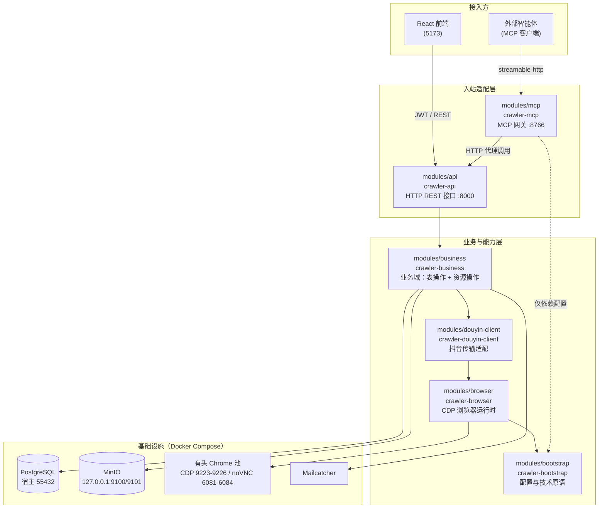
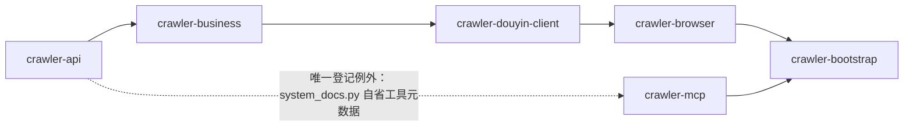
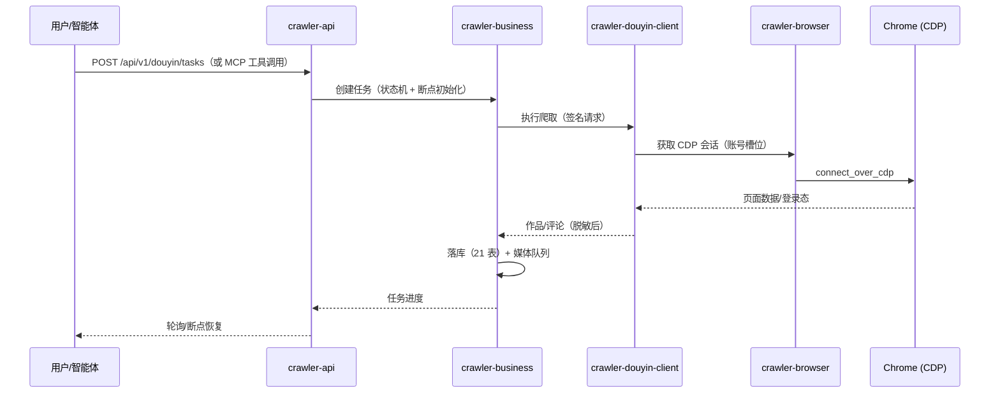

# 项目架构分析

> 生成时间：2026-08-18 ｜ 分支：`refactor/uv-workspace-modules`
> 架构形态：uv workspace 多项目 monorepo，六个独立 Python 项目共享 `crawler.*` 命名空间（PEP 420）

## 一、系统总览

本项目是一个以抖音数据采集为核心的全栈系统：以 FastAPI 官方 full-stack 模板为底座（React 前端、JWT 鉴权、PostgreSQL、Alembic），叠加抖音爬取、媒体处理（视频下载 + 远程字幕）、赛道数据归属、MCP 智能体接入四大业务能力。浏览器操作**只允许 CDP 模式**——连接已开启远程调试的 Chrome/Edge，失败即报错，绝不回退到 Playwright 标准启动。

### 1.1 整体架构图



### 1.2 模块依赖方向（DAG，由打包元数据 + 架构测试双重强制）



依赖规则要点：

- `bootstrap` 不依赖任何其他 workspace 模块，处于 DAG 最底层。
- 禁止反向依赖；`crawler/api/main.py` 是运行时组合根。
- `mcp` 是薄网关，不建立第二套业务逻辑，所有工具经 HTTP 复用 API 能力。

## 二、六个模块详解

### 2.1 modules/bootstrap（crawler-bootstrap）—— 运行配置与技术原语

**一句话定位**：整个系统的"地基"，只提供最基础、无任何业务语义的运行时原语。

| 文件 | 提供的能力 |
|------|-----------|
| `settings.py` | pydantic-settings 全局配置（数据库、JWT、CORS、邮件、Whisper、MinIO、MCP 等全部环境变量）；`BASE_DIR` 锚定仓库根，`.env`/`.env.local` 加载与相对路径解析不依赖进程工作目录 |
| `database.py` | SQLModel/SQLAlchemy engine 与 Session 工厂 |
| `security.py` | 密码哈希（pwdlib）与 JWT 签发/校验 |
| `logging.py` | 日志配置，敏感传输字段（Cookie、Token）收敛 |

**设计约束**：不得依赖任何其他 workspace 模块；不导入 FastAPI/Playwright。

### 2.2 modules/browser（crawler-browser）—— CDP-only 浏览器运行时

**一句话定位**：把"浏览器"这件事完全封装——只通过 CDP 连接已有浏览器，是系统与 Chrome 之间的唯一通道。

| 文件 | 提供的能力 |
|------|-----------|
| `cdp/` | CDP 端点发现、`connect_over_cdp` 连接、端口探测 |
| `session.py` | CDP 会话管理：stealth 反检测注入、自动化标签页生命周期 |
| `remote.py` | Docker 远程浏览器槽位管理（账号槽位池，多实例分配） |
| `errors.py` | `CDPConnectionError`——连接失败直接失败，禁止 launch 回退 |
| `resources/stealth.js` | 反自动化检测注入脚本 |

**设计约束**：只依赖 bootstrap；禁止 `chromium.launch()` / `launch_persistent_context()`。

### 2.3 modules/douyin-client（crawler-douyin-client）—— 抖音传输适配

**一句话定位**：抖音平台的"协议层"——所有与抖音服务器/页面交互的细节都封装在这里，对上层只暴露干净的客户端接口。

| 文件 | 提供的能力 |
|------|-----------|
| `client.py` | 签名 HTTP 客户端（搜索、作品详情、评论、用户主页等读接口） |
| `signer.py` | `a_bogus` 请求签名（PyExecJS → Node 执行 `douyin.js`） |
| `login.py` | 扫码登录 / Cookie 登录流程 |
| `interactions.py` | 页面互动写回：评论发表/回复、私信等经 CDP 页面的操作 |
| `privacy.py` | HMAC 脱敏与昵称打码（创作者/评论用户信息落库前必经此层） |
| `types.py` / `errors.py` | 传输层类型定义与 `DouyinError`/`DataFetchError`/`LoginError` |
| `resources/douyin.js` | 签名算法（沿用 MediaCrawler，非商业学习许可证） |

**设计约束**：只依赖 browser/bootstrap；不得直接访问业务表、不得管理事务；Cookie/原始账号 ID 不出此层。

### 2.4 modules/business（crawler-business）—— 业务域（核心模块）

**一句话定位**：系统的心脏，包含**全部表操作（21 张表）和全部资源操作**——业务模型、用例编排、后台任务管理、存储/媒体/HTTP 技术驱动、数据库迁移。

#### 技术设施

| 位置 | 提供的能力 |
|------|-----------|
| `model_registry.py` | 显式注册全部 21 张表到 SQLModel.metadata（Alembic 与架构测试的统一事实源） |
| `concurrency/` | `FairLimiter`：按 key 公平轮转限流，大任务不阻塞小任务 |
| `resources/storage/` | 存储驱动：`local.py`（本地文件）与 `minio.py`（对象存储）——MinIO SDK 唯一允许出现的位置 |
| `resources/media/ffmpeg.py` | FFmpeg 音轨提取（16kHz 单声道压缩音频，供远程字幕） |
| `resources/http/ranges.py` | HTTP Range 流式响应（视频进度条拖动，不整段加载） |
| `alembic/` + `alembic.ini` | 数据库迁移（`modules/business` 下执行 `alembic upgrade head`） |

#### 通用子域

| 子域 | 提供的能力 |
|------|-----------|
| `identity/` | 用户模型与服务、首次启动引导、邮件发送（MJML 模板） |
| `items/` | 模板自带的演示切片 |
| `common/` `system/` | 通用模型与系统文档模型 |

#### 抖音业务子域（`douyin/`，10 个）

| 子域 | 提供的能力 |
|------|-----------|
| `accounts/` | 抖音账号槽位：账号选择、状态管理、CDP 槽位绑定 |
| `tasks/` | 采集任务核心：任务状态机、断点持久化与恢复（`crawler.py` 编排 search/detail/creator/liked/collected 五类任务） |
| `tracks/` | 赛道：关键词/任务/内容的一级归属维度，默认赛道保护、删除前数据迁移 |
| `keywords/` | 关键词库：按赛道组织、批量建任务 |
| `comments/` | 评论落库（脱敏后）与评论库查询导出 |
| `content/` | 作品内容模型（仅 models，例外登记） |
| `tags/` | 标签体系与历史标签同步 |
| `media/` | 媒体资产：视频下载队列、远程字幕（OpenAI 兼容转录 API）、本地↔MinIO 迁移（SHA-256 完整校验后切换） |
| `library/` | 资源库：跨任务的作品/评论统一检索 |
| `interactions/` | 互动管理：点赞/收藏关系、评论回复执行器 |

**分包规范**（架构测试机器强制）：每个子域固定 `models.py` + `service.py` 两件套；重读场景追加 `query_service.py`；专有编排用同名模块（如 `tasks/crawler.py`、`tracks/bindings.py`）。

### 2.5 modules/api（crawler-api）—— HTTP 入站适配

**一句话定位**：纯协议层——只做参数校验、JWT 鉴权、调用 business、HTTP 异常/响应映射，不含任何业务逻辑。

| 位置 | 提供的能力 |
|------|-----------|
| `main.py` | FastAPI 应用装配与 lifespan（组合根） |
| `router.py` + `routes/` | 15 个路由模块：抖音 9 组（tasks/tracks/keywords/accounts/catalog/interactions/media/tags/douyin 核心 30 条）+ 模板 6 组（login/users/items/utils/private/system_docs） |
| `deps.py` | `SessionDep` / `CurrentUser` 等依赖注入 |
| `backend_pre_start.py` / `initial_data.py` / `tests_pre_start.py` | 启动前数据库等待、首超管初始化、测试前置（登记的 SQL 使用例外） |

**设计约束**：路由禁止直接使用 SQLAlchemy/SQLModel 查询（登记脚本除外）、MinIO、Playwright、文件路径判断或事务操作。

### 2.6 modules/mcp（crawler-mcp）—— MCP 入站网关

**一句话定位**：把系统能力暴露给外部智能体的薄网关——32 个工具全部经 HTTP 代理到同一 FastAPI 服务，零业务逻辑复制。

| 位置 | 提供的能力 |
|------|-----------|
| `server.py` / `runtime.py` / `__main__.py` | MCP Server 装配；支持 stdio 与 streamable-http（127.0.0.1:8766）两种传输 |
| `tools/tasks.py` | 任务工具：创建/查询/取消/恢复任务、单视频评论重爬、作者作品抓取 |
| `tools/accounts.py` | 账号槽位查询与管理 |
| `tools/catalog.py` | 作品/评论/互动分页读取、资源库检索 |
| `tools/interactions.py` | 互动数据工具 |
| `tools/media.py` | 媒体工具：完成后媒体处理、进度查询、失败重试、重新翻译、迁移 MinIO |

**鉴权模型**：端口只监听本机回环；服务端用环境变量（`MCP_API_USERNAME`/`MCP_API_PASSWORD`，缺省回退 `FIRST_SUPERUSER`）登录 FastAPI，客户端 JSON 不含任何凭据。

## 三、运行时部署拓扑

| 容器 | 镜像/来源 | 端口 | 职责 |
|------|-----------|------|------|
| `backend` | `docker/api/Dockerfile`（python:3.10 + uv + Node.js + 复用 mediacrawler 镜像的 FFmpeg） | 8000 | FastAPI 服务（单 worker，CDP 会话与任务注册表要求） |
| `prestart` | 同 backend 镜像 | — | 启动前：等待 DB → `alembic upgrade head` → 初始数据 |
| `mcp` | 同 backend 镜像 | 127.0.0.1:8766 | MCP streamable-http 网关 |
| `db` | postgres | 宿主 55432 → 5432 | PostgreSQL（21 张表） |
| `minio` | compose.storage.yml | 127.0.0.1:9100/9101 | 视频对象存储（bucket 私有，经后端代理访问） |
| `douyin-browser` ×4 | compose.browser.yml + browser-pool.yml | CDP 9223-9226、noVNC 6081-6084 | 有头 Chrome（Xvfb），登录态存 `douyin-browser-profile` 卷 |
| `frontend` | React/Vite | 5173 | Web 控制台 |
| `mailcatcher` | — | 1025/1080 | 开发环境邮件捕获 |

## 四、质量保障体系

### 4.1 架构契约测试（`tests/architecture/`）

- **四哈希基线**：OpenAPI（76 paths/112 schemas）、SQLModel metadata（21 表）、MCP 工具（32 个）、抖音核心路由（30 条 method/path/operationId/注册顺序）——纯重构不得改变任何一个哈希。
- **AST 依赖边界检查**：按 DAG 约束 `crawler.*` 内部 import 与各层第三方框架。
- **分包规范检查**：命名空间无 `__init__.py`、子域两件套、资源文件存在性、monkeypatch 目标存在性。

### 4.2 质量门禁（仓库根执行）

```powershell
uv run ruff check modules tests
uv run ruff format modules tests --check
uv run mypy -p crawler.bootstrap -p crawler.browser -p crawler.douyin_client -p crawler.business -p crawler.api -p crawler.mcp
uv run pytest                    # 352 个测试
Set-Location modules/business; uv run alembic check   # 模型与迁移零漂移
```

### 4.3 安全红线

- Cookie、Token、原始账号 ID 不得写入数据库、日志或 API 响应。
- 创作者/评论用户信息必须经 `douyin-client/privacy.py` 脱敏后落库。
- CDP 端口与 noVNC 只绑定回环地址，禁止公网暴露。
- 媒体预览使用短时 HttpOnly Cookie 会话（默认 300 秒），令牌不进 URL/日志。

## 五、关键数据流


